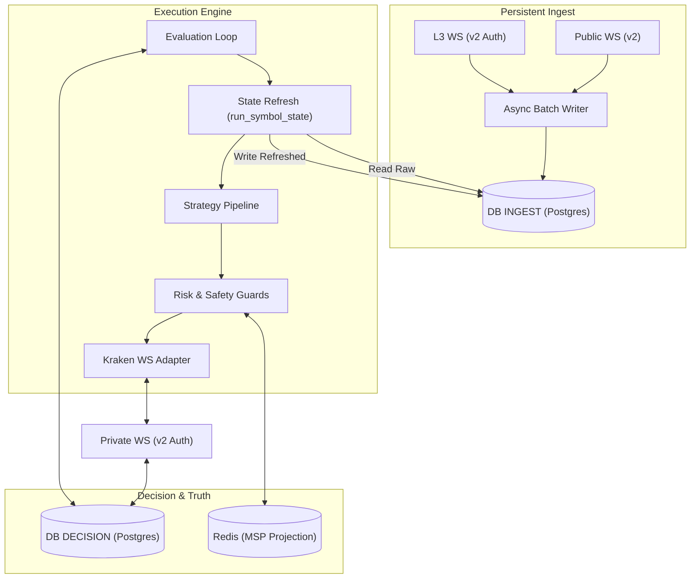
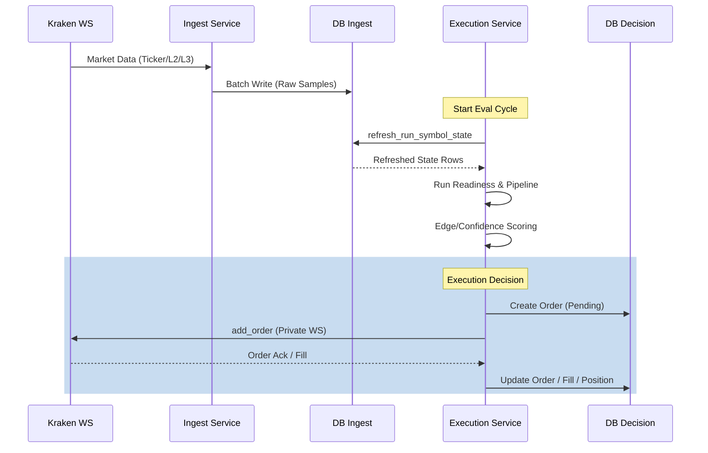
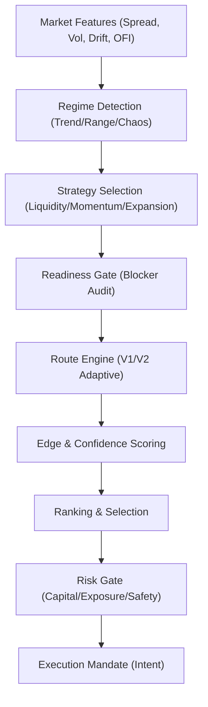
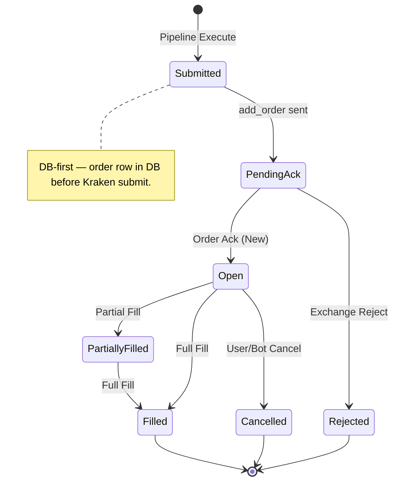

# 01 — Systeemarchitectuur

[← 00 — Module-inventaris](./00_MODULE_INVENTORY.md) | **01 — Architectuur** | [02 — Data-ingest](./02_DATA_INGEST.md) →

---

Dit document beschrijft de architectuur van de Krakenbot trading engine: componenten, datastromen, database-topologie en procesmodellen.

## Navigatiemenu

- [Systeemoverzicht](#systeemoverzicht)
- [Runtime Topologie](#runtime-topologie)
- [Datastromen (Live Pad)](#datastromen-live-pad)
- [Strategy Pipeline Flow](#strategy-pipeline-flow)
- [Execution Lifecycle](#execution-lifecycle)
- [Database Topologie (SSOT)](#database-topologie-ssot)
- [Procesmodel & Services](#procesmodel-services)

---

## Systeemoverzicht

De Krakenbot is opgebouwd uit modulaire lagen met strikte verantwoordelijkheden:

- **Ingest Laag**: Verwerkt publieke en private WebSocket feeds, valideert checksums (L2) en persisteert ruwe marktdata.
- **State & Projection**: Onderhoudt de in-memory en Redis-backed toestand van de markt (MSP), orderboeken en balansen.
- **Strategy Pipeline**: Analyseert regimes, berekent edge/confidence en genereert execution mandates.
- **Execution Engine**: Beheert de order lifecycle, positie-monitoring, trailing stops en risk guards.
- **Observability**: Verzamelt metrics, logt funnel-events en faciliteert forward-return analyse.

---

## Runtime Topologie

Krakenbot gebruikt een **dual-pool architectuur** om ingest-load te scheiden van execution-latency.

---

## Datastromen (Live Pad)

Het systeem is **state-first** en **route-centric**. De hot-path scant geen ruwe tabellen per tick, maar gebruikt een ververste `run_symbol_state`.

---

## Strategy Pipeline Flow

De pipeline transformeert marktdata naar uitvoerbare plannen via een hiërarchie van filters en scorers.

---

## Execution Lifecycle

Orders doorlopen een strikte state-machine om consistentie tussen de database en de exchange te garanderen.

---

## Database Topologie (SSOT)

Het systeem onderscheidt drie logische rollen voor data-opslag:

| Pool | Omgevingsvariabele | Primaire Inhoud (SSOT) |
| :--- | :--- | :--- |
| **INGEST** | `INGEST_DATABASE_URL` | Ruwe marktdata, L2/L3 metrics, `run_symbol_state` (refreshed). |
| **DECISION** | `DECISION_DATABASE_URL` | Orders, Fills, Posities, Safety State, Watchdog logs. |
| **RESEARCH** | `RESEARCH_DATABASE_URL` | Forward-return observations, Microstructure snapshots. |

> **Harde Regel**: Geen cross-pool joins in de applicatie. Gebruik `db_target_precheck.sh` voor diagnose.

---

## Procesmodel & Services

Krakenbot draait als een set van **systemd** services op de productie-server (`/srv/krakenbot`):

1. **`krakenbot-ingest.service`**:
   - Taak: Continue dataverzameling.
   - Mode: `run-ingest`.
   - Schrijft naar: INGEST pool.

2. **`krakenbot-execution.service`**:
   - Taak: Strategie-evaluatie en trading.
   - Mode: `run-execution-live`.
   - Schrijft naar: DECISION pool.

3. **Maintenance**:
   - `retention`: Periodieke opschoning van oude samples.
   - `watchdog`: Bewaakt consistentie en herstelt stale states.

---

[← 00 — Module-inventaris](./00_MODULE_INVENTORY.md) | **01 — Architectuur** | [02 — Data-ingest](./02_DATA_INGEST.md) →

---

*Document gegenereerd voor technische documentatie. Laatst bijgewerkt: 2026-04-13.*
