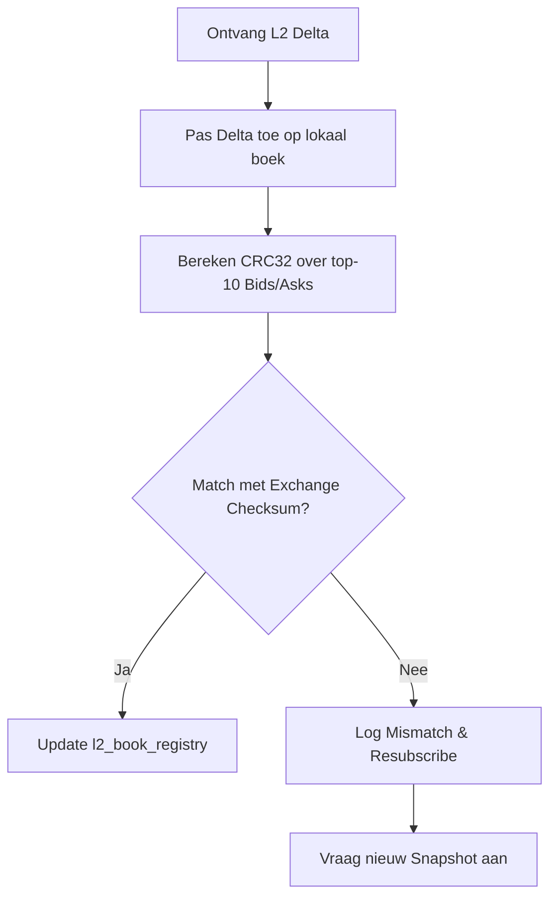
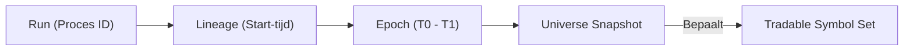

# 02 — Data-ingest & Marktdata Laag

[← 01 — Architectuur](./01_ARCHITECTURE.md) | **02 — Data-ingest** | [03 — Strategy Pipeline](./03_STRATEGY_PIPELINE.md) →

---

Dit document beschrijft hoe Krakenbot marktdata en gebruikersdata consumeert, verwerkt en persisteert. De focus ligt op de WebSocket v2 implementatie en de integriteitswaarborgen.

## Navigatiemenu

- [WebSocket Architectuur (v2)](#websocket-architectuur-v2)
- [Public Market Data Feeds](#public-market-data-feeds)
- [Private & L3 Data Feeds](#private-l3-data-feeds)
- [L2 Checksum & Integriteit](#l2-checksum-integriteit)
- [Data Verwerking & Samples](#data-verwerking-samples)
- [Epochs & Run Lifecycle](#epochs-run-lifecycle)

---

## WebSocket Architectuur (v2)

Krakenbot gebruikt de Kraken WebSocket API v2 als primaire bron voor real-time data.

- **Muxing**: Gebruik van `private_ws_hub` voor efficiënte routing van private berichten op basis van `req_id`.
- **Backpressure**: Gebruik van bounded channels en async writers om te voorkomen dat een trage database de WebSocket-consumptie blokkeert.
- **Reconnect Doctrine**: Bij elke reconnect wordt een nieuw `GetWebSocketsToken` opgehaald. Tokens zijn alleen geldig voor de duur van de sessie.

---

## Public Market Data Feeds

Verbinding via `wss://ws.kraken.com/v2`.

| Channel | Gebruik in Krakenbot | Frequentie |
| :--- | :--- | :--- |
| **`ticker`** | Top-of-book (L1) prijzen voor de `price_cache`. | Real-time (event-driven) |
| **`book`** | L2 orderboek snapshots en deltas (depth 10-1000). | Real-time |
| **`trade`** | Individuele trades voor volume-analyse en VWAP. | Real-time |
| **`instrument`** | **SSOT** voor tick-size, qty-step en min-notional. | Bij start & wijziging |
| **`ohlc`** | 1m candles voor regime-detectie en ATR. | Per candle/trade |

---

## Private & L3 Data Feeds

Deze feeds vereisen authenticatie via een REST-token.

- **`executions` (Private)**: De absolute waarheid voor order-status en fills. Krakenbot vertrouwt op dit kanaal voor de `own_orders_cache` en `fills_ledger`.
- **`balances` (Private)**: Update de `balance_cache` voor risk-checks en positie-sizing.
- **`level3` (L3)**: Individuele orders (niet geaggregeerd). Gebruikt voor `queue_metrics` en microstructure-analyse. Beperkt tot max 200 symbolen per verbinding.

---

## L2 Checksum & Integriteit

Voor het L2 orderboek (`book` channel) is integriteit cruciaal. Krakenbot implementeert de officiële Kraken CRC32 checksum validatie.

- **Mismatch Gevolg**: Bij een mismatch wordt het symbool als "unreliable" gemarkeerd in de `tradability` state, wat nieuwe entries blokkeert tot het boek hersteld is.

---

## Data Verwerking & Samples

Ruwe data wordt getransformeerd naar persistente samples in de **INGEST** database.

1. **`trade_samples`**: Elke trade wordt gelogd met side, prijs, volume en timestamp.
2. **`l2_snap_metrics`**: Periodieke snapshots van book-imbalance en density.
3. **`l3_queue_metrics`**: Analyse van de positie van orders in de L3-queue.

Deze data voedt de `refresh_run_symbol_state` taak, die de input genereert voor de volgende evaluatie-tick.

---

## Epochs & Run Lifecycle

Krakenbot deelt tijd in via `runs` en `epochs` om determinisme te waarborgen.

- **`ingest_runner`**: Verantwoordelijk voor het aanmaken van nieuwe epochs en het verversen van de universe op basis van instrument-data.
- **`run_id`**: Alle samples en metrics zijn gekoppeld aan een `run_id` voor eenvoudige opschoning (retention) en forensics.

---

[← 01 — Architectuur](./01_ARCHITECTURE.md) | **02 — Data-ingest** | [03 — Strategy Pipeline](./03_STRATEGY_PIPELINE.md) →

---

*Document gegenereerd voor technische documentatie. Laatst bijgewerkt: 2026-04-13.*
