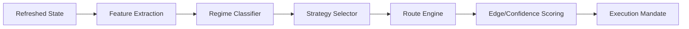
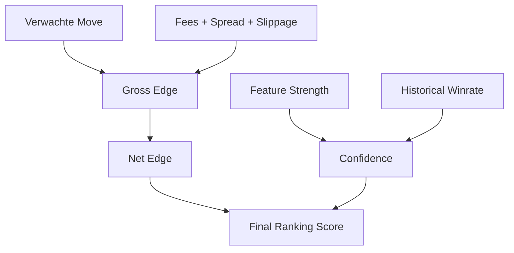

# 03 — Strategy Pipeline & Signaalgeneratie

[← 02 — Data-ingest](./02_DATA_INGEST.md) | **03 — Strategy Pipeline** | [04 — Execution & Orders](./04_EXECUTION_ORDERS.md) →

---

Dit document beschrijft de "denklaag" van Krakenbot: hoe ruwe marktdata wordt getransformeerd in handelsbeslissingen via de strategy pipeline en de route engine.

## Navigatiemenu

- [Pipeline Architectuur](#pipeline-architectuur)
- [Market Features & Extractie](#market-features-extractie)
- [Regime Detection](#regime-detection)
- [Route Engine (V1 & V2)](#route-engine-v1-v2)
- [Edge & Confidence Math](#edge-confidence-math)
- [Decision Persistence (CDV)](#decision-persistence-cdv)

---

## Pipeline Architectuur

De pipeline is een lineair proces dat elke evaluatie-tick (getriggerd door `mid_price` wijzigingen of timers) wordt doorlopen.

---

## Market Features & Extractie

Features zijn de numerieke bouwstenen voor alle beslissingen. Ze worden berekend in `route_engine::market_features`.

- **Microstructure**: Spread, book-imbalance (L2), queue-pressure (L3).
- **Momentum**: Getekende drift en versnelling over meerdere horizons (5s tot 15m).
- **Volume**: Buy/sell imbalance uit de `trade_flow_window`.
- **Volatility**: ATR (Average True Range) en realized volatility.

---

## Regime Detection

Voordat strategieën worden geëvalueerd, bepaalt de `regime_detection` de huidige marktomstandigheden:

- **TREND**: Duidelijke directionele beweging met volume-ondersteuning.
- **RANGE**: Consolidatie tussen bekende L2-levels.
- **EXPANSION**: Plotselinge toename in volatiliteit en spread (Phase 1).
- **CHAOS**: Onvoorspelbare microstructure (vaak een block-conditie).

---

## Route Engine (V1 & V2)

De Route Engine (`route_engine::route_selector`) evalueert specifieke "Move Theses".

- **V1 (Deterministisch)**: Gebruikt vaste drempels en lineaire scoring.
- **V2 (Adaptief)**: Gebruikt historische uitkomsten uit de RESEARCH pool om scores aan te passen aan recente marktprestaties (`edge_engine`).

### Move Theses
Een thesis is een hypothese over de prijsbeweging, bijv:
- `AtrBreakout`: Prijs breekt door een ATR-band.
- `MeanReversion`: Prijs keert terug naar de VWAP.
- `LiquiditySweep`: Absorptie van een groot L2-level.

---

## Edge & Confidence Math

Elke route krijgt een **Edge** (verwachte winst in bps) en een **Confidence** (betrouwbaarheid).

- **Edge**: `(Expected Move - Transaction Costs)`.
- **Confidence**: Een genormaliseerde waarde (0.0 - 1.0) gebaseerd op signaalsterkte en historische marktoutcomes.

---

## Decision Persistence (CDV)

Elke serieuze kandidaat wordt opgeslagen als een **Candidate Decision Vector (CDV)** in de `DECISION` database.

- **Traceerbaarheid**: De CDV bevat alle inputs (features) en outputs (edge, confidence, reason codes).
- **Shadow Markouts**: Ook niet-gekozen routes worden gelogd om "counterfactual" analyses mogelijk te maken (wat als we wél hadden getrade?).

---

[← 02 — Data-ingest](./02_DATA_INGEST.md) | **03 — Strategy Pipeline** | [04 — Execution & Orders](./04_EXECUTION_ORDERS.md) →

---

*Document gegenereerd voor technische documentatie. Laatst bijgewerkt: 2026-04-13.*
