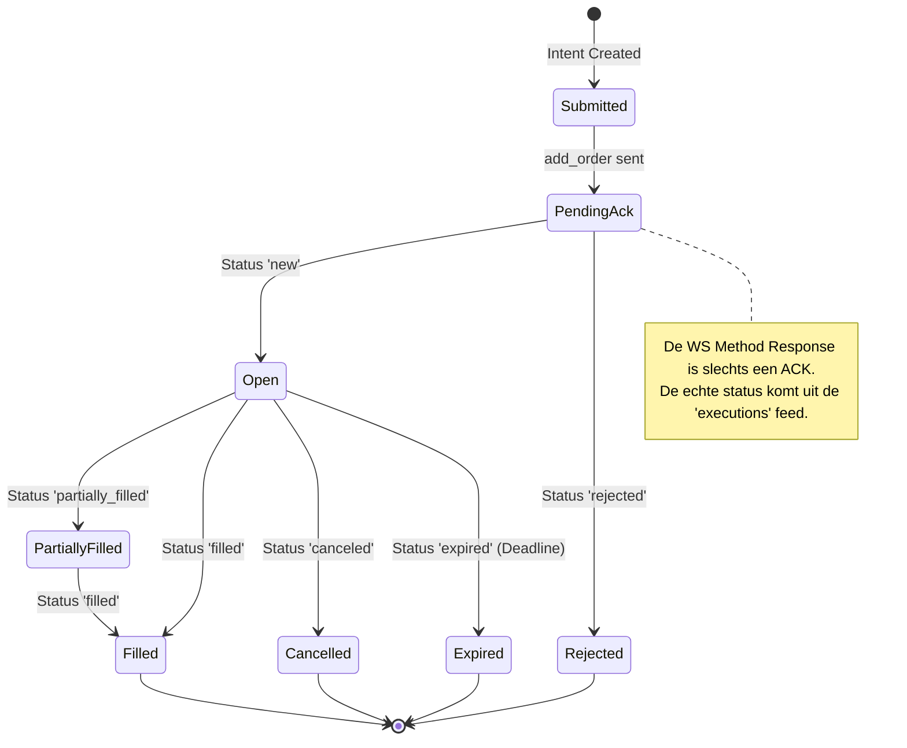

# 04 — Execution & Order Lifecycle

[← 03 — Strategy Pipeline](./03_STRATEGY_PIPELINE.md) | **04 — Execution & Orders** | [05 — Protection & Exit](./05_PROTECTION_EXIT.md) →

---

Dit document beschrijft de executielaag van Krakenbot: hoe intenties worden omgezet in orders, hoe de lifecycle wordt beheerd en hoe de integriteit met de exchange wordt gewaarborgd.

## Navigatiemenu

- [Flow Poller & Execution](#flow-poller--execution)
- [Order Placement (WS v2)](#order-placement-ws-v2)
- [Order State Machine (SSOT)](#order-state-machine-ssot)
- [Fill Handling & Ledger](#fill-handling--ledger)
- [Dead-Man's Switch (Safety)](#dead-mans-switch-safety)
- [Database Persistence](#database-persistence)

---

## Flow Poller & Execution

De `flow_poller` is de motor van de executielaag. Het ontkoppelt de "denk-cyclus" (pipeline) van de "doe-cyclus" (submit).

- **Flow Heap**: De pipeline plaatst kandidaten in een geprioriteerde heap (`edge_heap`).
- **Continuous Drain**: de `flow_poller` haalt continu de beste kandidaat uit de heap en probeert deze uit te voeren, mits de `choke` (safety check) groen licht geeft.
- **Concurrency**: Het systeem ondersteunt parallelle executie voor verschillende symbolen, maar dwingt volgordelijkheid af per symbool.

---

## Order Placement (WS v2)

Alle trading acties verlopen via de Private WebSocket v2 (`ws-auth.kraken.com`).

- **`add_order`**: Primaire methode voor entry en exit.
- **`amend_order`**: Gebruikt voor het verplaatsen van limit orders (bijv. bij trailing) zonder queue-prioriteit volledig te verliezen.
- **`cancel_order`**: Voor het intrekken van open orders.
- **`req_id` Muxing**: Elk verzoek krijgt een uniek ID zodat de asynchrone respons correct gekoppeld kan worden aan de interne state.

---

## Order State Machine (SSOT)

Krakenbot hanteert een strikte 13-state machine (`execution::order_state`). De **`executions`** WebSocket feed is de Single Source of Truth.

---

## Fill Handling & Ledger

Wanneer een order (gedeeltelijk) gevuld wordt, treedt het `fills_ledger` in werking. Dit proces is **idempotent** om dubbele verwerking van WS-berichten te voorkomen.

1. **Fill Registratie**: De fill wordt opgeslagen in de `fills` tabel.
2. **Position Update**: De netto exposure in `krakenbot.positions` wordt bijgewerkt.
3. **Protection Trigger**: Voor entry-fills wordt direct de protectie-logica geactiveerd (zie [05 — Protection & Exit](./05_PROTECTION_EXIT.md)).
4. **PnL Calculatie**: Bij een sluitende fill wordt de realized PnL berekend en opgeslagen.

---

## Dead-Man's Switch (Safety)

Om te voorkomen dat orders "wees" achterblijven bij een crash of netwerkstoring, gebruikt de bot `cancel_all_orders_after`.

- **Werking**: De bot stuurt elke 15-30 seconden een verzoek om alle orders na 60 seconden te annuleren.
- **Fail-Safe**: Als de bot stopt met pingen, annuleert de exchange automatisch alle open orders na het verstrijken van de timer.

---

## Database Persistence

Alle order-activiteit wordt gelogd in de `DECISION` database:

- **`execution_orders`**: De hoofdtabel voor alle orders, inclusief `cl_ord_id` en `exchange_order_id`.
- **`order_events`**: Een audit-log van elke statusovergang.
- **`order_latency`**: Meet de tijd tussen T0 (beslissing), T1 (submit), T2 (ack) en T3 (fill).

---

[← 03 — Strategy Pipeline](./03_STRATEGY_PIPELINE.md) | **04 — Execution & Orders** | [05 — Protection & Exit](./05_PROTECTION_EXIT.md) →

---

*Document gegenereerd voor technische documentatie. Laatst bijgewerkt: 2026-04-13.*
