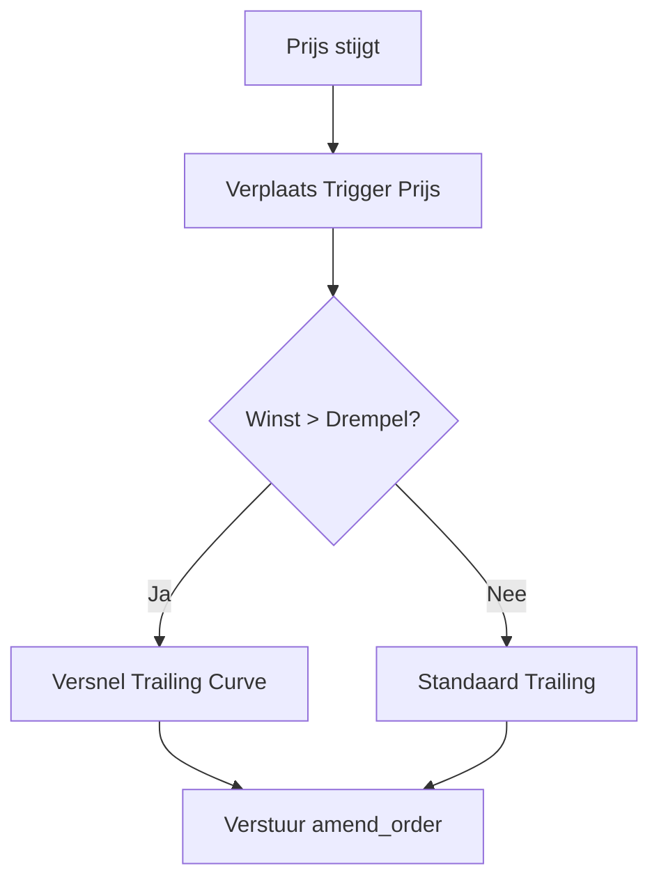

# 05 — Protection & Exit Strategieën

[← 04 — Execution & Orders](./04_EXECUTION_ORDERS.md) | **05 — Protection & Exit** | [06 — Risk & Safety](./06_RISK_SAFETY.md) →

---

Dit document beschrijft hoe Krakenbot open posities beheert, beschermt en sluit. Het doel is het maximaliseren van winst bij asymmetrische moves en het strikt beperken van verliezen.

## Navigatiemenu

- [Protectie-types (TSL, SL, TP)](#protectie-types-tsl-sl-tp)
- [Trailing Stop Logica](#trailing-stop-logica)
- [Exit Scenario's & Regels](#exit-scenarios--regels)
- [Position Monitor & Advisory](#position-monitor--advisory)
- [Technisch Herstel (Orphans & Dust)](#technisch-herstel-orphans--dust)

---

<a name="protectie-types-tsl-sl-tp"></a>
## Protectie-types (TSL, SL, TP)

Zodra een positie geopend is, plaatst de bot direct beschermende orders.

- **Stop-Loss (SL)**: Een harde prijs-trigger die de positie sluit bij een ongunstige beweging.
- **Trailing-Stop (TSL)**: Een dynamische stop die meebeweegt met de prijs in gunstige richting. Dit is de primaire methode om winst te vergrendelen.
- **Take-Profit (TP)**: Een koersdoel waarbij de positie (deels) gesloten wordt. Dit kan een limit-order zijn of een market-exit getriggerd door de bot.

---

<a name="trailing-stop-logica"></a>
## Trailing Stop Logica

De TSL-logica is adaptief en gebaseerd op volatiliteit (`ATR`) en winst-progressie.



- **Breakeven**: Zodra een positie een bepaalde winst behaalt, wordt de stop naar de entry-prijs verplaatst.
- **ATR-Width**: De breedte van de trail wordt berekend in `execution::trail_atr` om rekening te houden met de "noise" van het instrument.

---

<a name="exit-scenarios--regels"></a>
## Exit Scenario's & Regels

Naast de exchange-side orders, bewaakt de bot posities via de `position_monitor` met specifieke regels:

1. **Harde 1% Loss Cap**: Als een positie meer dan 1% verlies toont (t.o.v. entry), wordt deze direct via een market-order gesloten. Geen uitzonderingen.
2. **Stale Position Exit**: Als een positie 5 minuten lang niet beweegt en in het verlies staat, volgt een exit.
3. **15-Minute Regime Shift**: Na 15 minuten verandert de filosofie:
   - Verlieslatend? Direct sluiten.
   - Winstgevend? De trailing stop wordt extreem strak aangetrokken om de winst te "oogsten".

---

<a name="position-monitor--advisory"></a>
## Position Monitor & Advisory

De `position_monitor` draait elke 30 seconden en evalueert elke positie tegen de `ManagementAdvice` uit de route-engine.

```mermaid
decision_tree [Exit Beslisboom]
    A[Positie Open] --> B{Loss > 1%?}
    B -- "Ja" --> C[Market Exit (Safety)]
    B -- "No" --> D{Leeftijd > 15m?}
    D -- "Ja" --> E{Winstgevend?}
    E -- "Nee" --> F[Market Exit (Time)]
    E -- "Ja" --> G[Tighten TSL (Harvest)]
    D -- "No" --> H{Stale / No Edge?}
    H -- "Ja" --> I[Market Exit (Advisory)]
    H -- "No" --> J[Continue Monitoring]
```

---

<a name="technisch-herstel-orphans--dust"></a>
## Technisch Herstel (Orphans & Dust)

Om operationele fouten op te vangen, zijn er twee herstelpaden:

- **Orphan Recovery**: Als er een positie op Kraken staat zonder bijbehorende protectie-order in de bot, wordt er direct een TSL geplaatst.
- **Top-Up Recovery**: Als een exit faalt omdat de positie net onder de `min_qty` van de exchange valt (dust), kan de bot een minimale hoeveelheid bijbestellen om de positie technisch sluitbaar te maken. Dit is een strikt technisch pad, geen "averaging down".

---

[← 04 — Execution & Orders](./04_EXECUTION_ORDERS.md) | **05 — Protection & Exit** | [06 — Risk & Safety](./06_RISK_SAFETY.md) →

---

*Document gegenereerd voor technische documentatie. Laatst bijgewerkt: 2026-04-13.*
