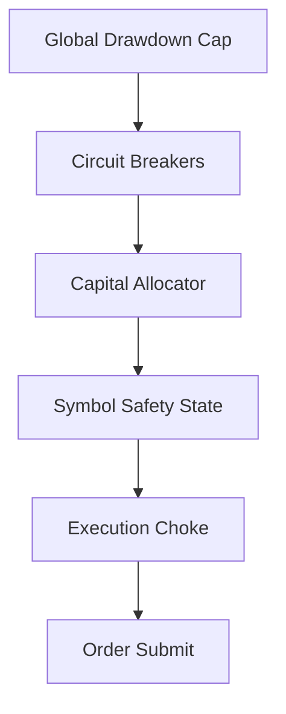
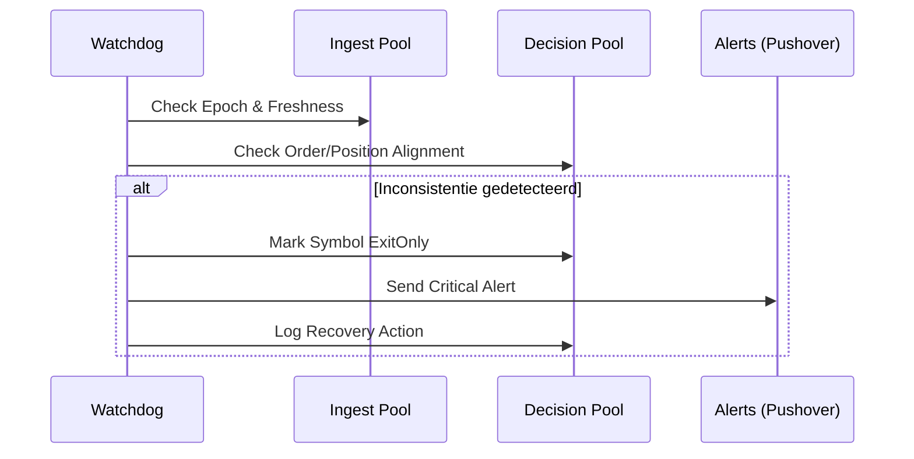

# 06 — Risk & Safety Guards

[← 05 — Protection & Exit](./05_PROTECTION_EXIT.md) | **06 — Risk & Safety** | [07 — Observability](./07_OBSERVABILITY.md) →

---

Dit document beschrijft de veiligheidslagen van Krakenbot. Het systeem is ontworpen om kapitaal te beschermen tegen marktfalen, exchange-storingen en softwarefouten via een hiërarchie van guards.

## Navigatiemenu

- [Guard Hiërarchie](#guard-hierarchie)
- [Capital Allocator & Sizing](#capital-allocator--sizing)
- [Exposure Reconcile & Truth](#exposure-reconcile--truth)
- [Symbol Safety State & Locks](#symbol-safety-state--locks)
- [Circuit Breakers & Drawdown](#circuit-breakers--drawdown)
- [Consistency Watchdog](#consistency-watchdog)

---

## Guard Hiërarchie

Veiligheid is opgebouwd in lagen, van globaal naar symbool-specifiek.

---

## Capital Allocator & Sizing

De `CapitalAllocator` bepaalt hoeveel kapitaal per trade wordt ingezet.

- **Slot Management**: Beperkt het aantal gelijktijdige open posities (bijv. max 5 slots).
- **Exposure Caps**: Maximale notionele waarde per symbool en per portfolio.
- **Dynamic Sizing**: Sizing wordt geschaald op basis van `edge` en `confidence`, maar altijd begrensd door de `hard_cap`.

---

## Exposure Reconcile & Truth

Dit proces zorgt dat de interne administratie (`DECISION` DB) overeenkomt met de werkelijkheid op Kraken.

1. **Startup Reconcile**: Bij de start van de `execution` service worden alle balansen en open orders gesynchroniseerd.
2. **Periodic Sync**: Elke 30-60 seconden controleert de bot of de `positions` tabel nog klopt met de `balance_cache`.
3. **Ghost Lock Prevention**: Voorkomt dat de bot denkt een positie te hebben (en dus een slot bezet houdt) terwijl deze op de exchange al gesloten is.

---

## Symbol Safety State & Locks

Elk symbool heeft een `SymbolSafetyState` in de database.

- **Execution Lock**: Voordat een order wordt verstuurd, wordt een lock gezet. Dit voorkomt "race conditions" waarbij twee evaluatie-ticks tegelijkertijd een order proberen te openen.
- **States**:
  - `Normal`: Volledige handel toegestaan.
  - `ExitOnly`: Geen nieuwe entries, alleen sluiten of beschermen.
  - `HardBlocked`: Alle acties geblokkeerd (bijv. na extreme slippage of API fouten).

---

## Circuit Breakers & Drawdown

Harde grenzen die het systeem stilleggen bij abnormaal gedrag.

- **Error Rate Breaker**: Stopt handel als het percentage mislukte API-calls boven een drempel komt.
- **Global Drawdown Cap**: Als het totale verlies over de laatste 24 uur een percentage van het kapitaal overschrijdt, schakelt de bot over naar `ExitOnly`.
- **Stale Data Breaker**: Blokkeert trading als de `price_cache` of `L2 book` langer dan X seconden geen updates heeft ontvangen.

---

## Consistency Watchdog

De `ConsistencyWatchdog` bewaakt de integriteit tussen de `INGEST` en `DECISION` pools.

- **Split-Brain Detectie**: Controleert of de `execution` service op dezelfde data (epoch) draait als de `ingest` service.

---

[← 05 — Protection & Exit](./05_PROTECTION_EXIT.md) | **06 — Risk & Safety** | [07 — Observability](./07_OBSERVABILITY.md) →

---

*Document gegenereerd voor technische documentatie. Laatst bijgewerkt: 2026-04-13.*
