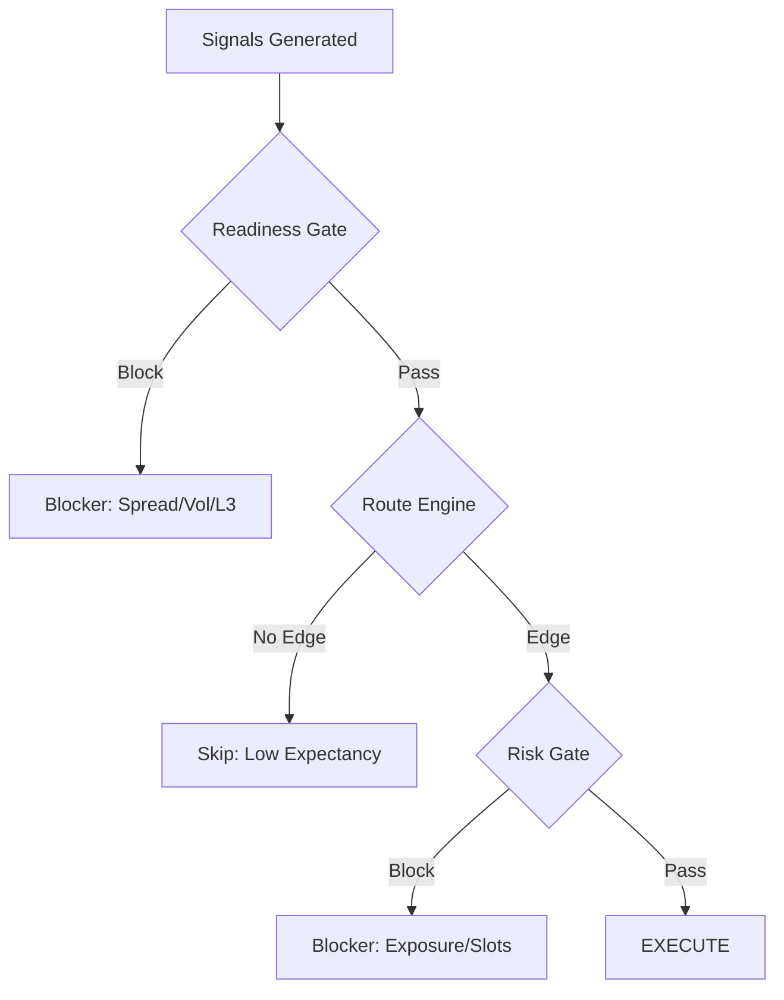
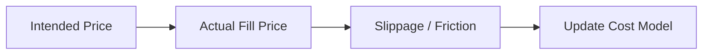

# 07 — Observability & Diagnostiek

[← 06 — Risk & Safety](./06_RISK_SAFETY.md) | **07 — Observability** | [08 — Operations](./08_OPERATIONS.md) →

---

Dit document beschrijft hoe Krakenbot inzicht geeft in zijn eigen werking, van real-time logging tot lange-termijn performance analyse (Forward-Returns).

## Navigatiemenu

- [Logging Taxonomie](#logging-taxonomie)
- [Trading Funnel & Events](#trading-funnel--events)
- [Forward-Return Observability](#forward-return-observability)
- [Edgeboard & CDV Snapshots](#edgeboard--cdv-snapshots)
- [Resource Telemetry](#resource-telemetry)
- [Fill Feedback & Slippage](#fill-feedback--slippage)

---

## Logging Taxonomie

Krakenbot gebruikt gestructureerde logging via het `tracing` crate. Om ruis te minimaliseren, zijn logs strikt ingedeeld:

- **`ERROR`**: Kritieke fouten die actie vereisen (bijv. DB verbinding verloren, API keys ongeldig).
- **`WARN`**: Onverwachte situaties (bijv. L2 checksum mismatch, order rejected).
- **`INFO`**: Belangrijke lifecycle events (bijv. order geplaatst, fill ontvangen, positie gesloten).
- **`DEBUG`**: Hoog-volume diagnostiek (bijv. elke evaluatie-tick, heartbeat, interne state-updates).

> **Opmerking**: Tijdens de cleanup-ronde zijn veel repetitieve `INFO` logs gedegradeerd naar `DEBUG` om de live-observatie werkbaar te houden.

---

## Trading Funnel & Events

De bot houdt een "funnel" bij om te zien waar signalen afvallen. Dit wordt opgeslagen in de `trading_funnel_events` tabel.

---

## Forward-Return Observability

Dit is het hart van de leer-lus van de bot. Het meet de kwaliteit van signalen, ook als ze **niet** zijn uitgevoerd.

- **`directional_forward_observations`**: Elke keer dat de pipeline een signaal ziet, wordt dit gelogd in de `RESEARCH` database.
- **Sweeper**: Een achtergrondtaak controleert na 5, 10 en 15 minuten wat de prijs heeft gedaan t.o.v. het signaal.
- **Markout**: Dit levert de "markout curve" op, die laat zien of onze entry-timing statistisch voordeel (edge) heeft.

---

## Edgeboard & CDV Snapshots

- **CDV (Candidate Decision Vector)**: Een rijke JSON-dump van alle features en scores op het moment van een beslissing.
- **Edgeboard**: Een real-time overzicht van de top-kandidaten per symbool, horizon en strategie. Dit wordt gebruikt voor de UI en voor handmatige inspectie van de "markt-kansen".

---

## Resource Telemetry

De bot bewaakt zijn eigen "footprint" om degradatie op de server te voorkomen.

- **CPU/RAM**: Gelogd via `observability::resource_telemetry`.
- **DB Latency**: Meet de tijd van SQL-queries om trage indexen of locks te detecteren.
- **Event Loop Lag**: Meet of de Tokio runtime de ticks op tijd kan verwerken.

---

## Fill Feedback & Slippage

Na elke fill berekent de bot de **slippage**: het verschil tussen de prijs waarop we *wilden* traden en de prijs die we *kregen*.

- **`fill_feedback`**: Deze data wordt gebruikt om de `cost_model` in de pipeline te verfijnen, zodat de bot in de toekomst realistischer rekent.

---

[← 06 — Risk & Safety](./06_RISK_SAFETY.md) | **07 — Observability** | [08 — Operations](./08_OPERATIONS.md) →

---

*Document gegenereerd voor technische documentatie. Laatst bijgewerkt: 2026-04-13.*
