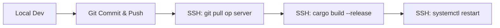

# 08 — Operations & Runbook

[← 07 — Observability](./07_OBSERVABILITY.md) | **08 — Operations** | [Index](./DOC_INDEX.md) →

---

Dit document bevat de praktische instructies voor het beheren, deployen en troubleshootbaar houden van Krakenbot op de productieserver. **SSH-doel (user@host) staat niet in deze repo** — gebruik je interne runbook of zet `DEPLOY_HOST` voor scripts zoals `./scripts/deploy.sh`.

## Navigatiemenu

- [Deployment Workflow (Git-only)](#deployment-workflow-git-only)
- [Systemd Services](#systemd-services)
- [Server Validatie & Checks](#server-validatie--checks)
- [Configuratie (.env)](#configuratie-env)
- [Incident Response & Noodstop](#incident-response--noodstop)

---

<a name="deployment-workflow-git-only"></a>
## Deployment Workflow (Git-only)

Krakenbot hanteert een strikte **Git-only codeflow**. Er worden nooit losse bestanden naar de server gekopieerd via SCP of FTP.



1. **Lokaal**: Wijzig code, run `cargo check`, commit en push.
2. **Server**: Ga naar `/srv/krakenbot`.
3. **Update**: `git pull --ff-only`.
4. **Build**: `export DEPLOY_HOST=user@<host>` en `./scripts/deploy.sh` (pull + `cargo build --release` op de server). **Herstart** systemd-units daarna handmatig volgens runbook (het script herstart geen services).

---

<a name="systemd-services"></a>
## Systemd Services

De bot draait als twee hoofddiensten.

- **`krakenbot-ingest.service`**: Verzamelt marktdata.
- **`krakenbot-execution.service`**: Voert de trading strategie uit.

### Handige Commando's
```bash
# Status bekijken
systemctl status krakenbot-execution

# Logs live volgen
journalctl -u krakenbot-execution -f

# Herstarten na config wijziging
systemctl restart krakenbot-execution
```

---

<a name="server-validatie--checks"></a>
## Server Validatie & Checks

Na een deploy of bij twijfel over de status, gebruik deze scripts:

- **`./scripts/db_target_precheck.sh`**: **Verplicht** vóór elk handmatig DB-onderzoek. Bewijst dat je op de juiste pool (Ingest/Decision) kijkt.
- **`./scripts/validate_live_engine_server.sh`**: Controleert of de binary correct is gebouwd, de DB bereikbaar is en de API keys werken.
- **`./scripts/ws_safety_report.sh`**: Geeft een overzicht van de WebSocket gezondheid en latency.

---

<a name="config-env"></a>
## Configuratie (.env)

De `.env` file in `/srv/krakenbot` is de Single Source of Truth voor configuratie.

| Variabele | Doel |
| :--- | :--- |
| `INGEST_DATABASE_URL` | Connectie naar de Ingest pool. |
| `DECISION_DATABASE_URL` | Connectie naar de Decision pool. |
| `EXECUTION_ENABLE` | `true` voor live trading, `false` voor alleen observeren. |
| `KRAKEN_API_KEY` | API sleutel van Kraken. |
| `EDGE_ENGINE_V2` | Schakelt de adaptieve V2 route-engine in. |

---

<a name="incident-response--noodstop"></a>
## Incident Response & Noodstop

In geval van nood (bijv. onverklaarbaar verlies of exchange errors):

1. **Noodstop**:
   ```bash
   systemctl stop krakenbot-execution
   ```
   *De Dead-Man's Switch op Kraken zal alle open orders binnen 60s annuleren.*

2. **Analyse**:
   - Check `journalctl -u krakenbot-execution -n 100`.
   - Run `./scripts/ws_safety_report.sh`.
   - Controleer open posities op de Kraken UI.

3. **Herstel**:
   - Los de bug op lokaal, commit en push.
   - Deploy opnieuw naar de server.
   - Start de service en monitor de `Startup Reconcile` logs nauwgezet.

---

[← 07 — Observability](./07_OBSERVABILITY.md) | **08 — Operations** | [Index](./DOC_INDEX.md) →

---

*Document gegenereerd voor technische documentatie. Laatst bijgewerkt: 2026-04-13.*
