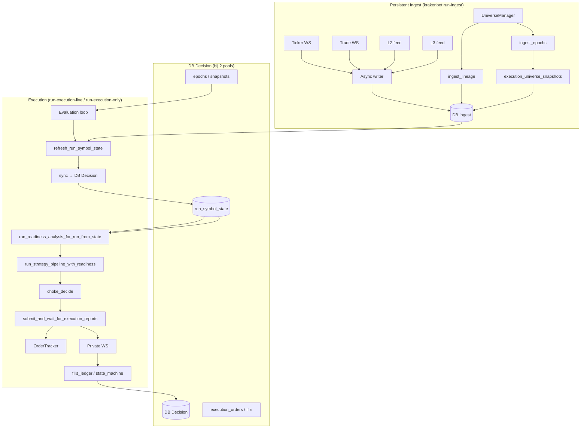
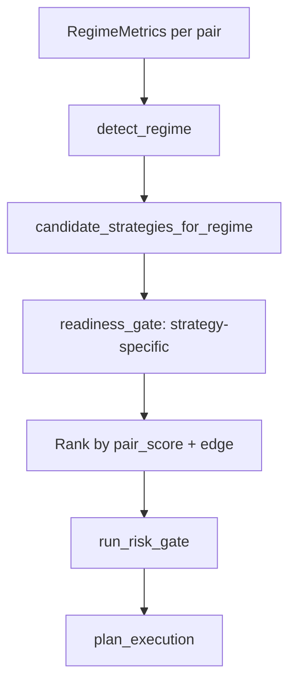
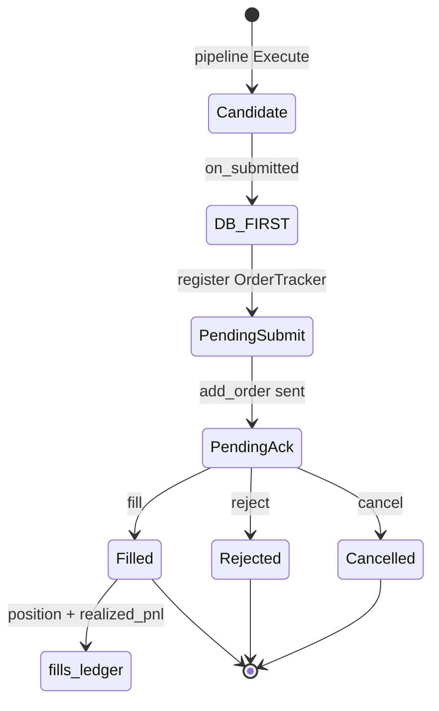

# Architecture — Current Engine Status

DOC_STATUS: CURRENT  
DOC_ROLE: engine_architecture  

**Rol van dit document:** Huidige, echte architectuur van de Krakenbot-engine. Geen roadmap; alleen wat in code aanwezig is en runtime actief is. Leidend document voor architectuur is [ENGINE_SSOT.md](ENGINE_SSOT.md); dit document werkt de details uit.

---

## 1. Overzicht

Kraken spot **queue-aware hybrid maker** bot met multiregime/multistrategy pipeline, deterministic execution lifecycle, en optionele **persistent ingest** vs **execution attach** (split mode).

- **Geen dry-run, geen paper trading.** One production path; Kraken docs and live payloads only.
- **Ingest:** `run-ingest` — persistent WS (ticker/trade/L2/L3), universe manager, epoch/snapshot publish.
- **Execution:** `run-execution-live` (met of zonder eigen ingest) of `run-execution-only` (EXECUTION_ONLY=true, bind to bestaande epochs).

---

## 2. Runtime topology

**Dubbele DB:** Bij `DECISION_DATABASE_URL` zijn er twee pools: **DB Ingest** (raw + refresh) en **DB Decision** (state gesynct, epochs, snapshots, execution). Execution leest alleen van DB Decision; ingest schrijft alleen op DB Ingest; state wordt na refresh gesynct. Zonder `DECISION_DATABASE_URL` is het één pool.

**Systemd (operationeel):**

- `krakenbot-ingest.service` — persistent ingest (run-ingest).
- `krakenbot-execution.service` — execution (run-execution-live of run-execution-only).
- Zie [systemd/README.md](../systemd/README.md).

---

## 3. Data flow

**Live path (state-first):** Geen raw in hot path. Per evaluation: `refresh_run_symbol_state` op **DB Ingest** → bij 2 pools `sync_run_symbol_state_to_decision` naar **DB Decision** → readiness en pipeline lezen alleen uit state op **DB Decision**; execution alleen als generation_id op decision gelijk is aan cycle generation (gate). Orders/fills naar DB Decision.

```mermaid
flowchart LR
  WS[Public WS] --> Writer[writer]
  Writer --> DB_Ingest[(DB Ingest: raw)]
  DB_Ingest --> Refresh[refresh_run_symbol_state]
  Refresh --> Sync[sync]
  Sync --> State_D[(state op DB Decision)]
  State_D --> Readiness[readiness from state]
  Readiness --> Pipeline[strategy_pipeline]
  Pipeline --> Gate[generation + route freshness]
  Gate --> Outcomes[Execute / Skip]
  Outcomes --> Runner[runner: 1st Execute]
  Runner --> DBFirst[on_submitted]
  DBFirst --> Kraken[Kraken add_order]
  Kraken --> PrivateWS[Private WS]
  PrivateWS --> OrderTracker[OrderTracker]
  PrivateWS --> Fills[fills_ledger]
  Fills --> DB_Decision[(DB Decision)]
```

**Epoch/lineage:**

- Ingest: `create_lineage` → `create_epoch` → `insert_execution_universe_snapshot` → `update_epoch_status` (valid/degraded/invalid). Bij `DECISION_DATABASE_URL`: dual-write naar decision-pool.
- Execution: per cycle `current_valid_epoch_id` (of `current_epoch_for_exit_only`) + snapshot; leest state/epoch/snapshot van decision-pool bij fysieke scheiding.
- **Raw tabellen:** ticker_samples, trade_samples, l2_snap_metrics, l3_queue_metrics zijn gepartitioneerd (PARTITION BY RANGE (run_id)); retention via DELETE WHERE run_id.

---

## 4. Strategy flow

- **Regimes:** RANGE, TREND, HIGH_VOLATILITY, LOW_LIQUIDITY, CHAOS (`analysis/regime_detection.rs`).
- **Strategies:** Liquidity, Momentum, Volume, NoTrading (`pipeline/strategy_selector.rs`).
- **Readiness:** Per pair tradable + één dominante blocker; strategy-specific checks (`trading/readiness_gate.rs`).
- **Pipeline:** Load → edge_score → entry_filter → readiness → rank → size_quote_from_edge → risk_gate → plan. **Top-1:** live neemt eerste Execute outcome.

---

## 5. Execution lifecycle

- **DB-first:** Order row (execution_orders) vóór exchange submit.
- **OrderTracker:** Runtime cache; ws_handler update op ACK/FILL/REJECT/CANCEL.
- **Exit:** Post-fill: `run_post_fill_exit_phase` plaatst SL + optioneel maker TP. `position_monitor` (spawn in live runner) scant posities, trail SL, TP bij market. Zie exit_lifecycle, position_monitor.

---

## 6. Module status (actueel)

| Module | Status | Notes |
|--------|--------|------|
| observe/ | Niet wijzigen | Runner, feeds, writer, persistence. |
| exchange/kraken_public | Niet wijzigen | Public WS. |
| db/writer | Niet wijzigen | Async writer. |
| analysis/ | Ready | Regime, readiness, edge_score, cost_breakdown, fill_probability, slippage. |
| pipeline/strategy_pipeline | Ready | Load → edge → entry_filter → readiness → rank → risk_gate → outcomes. |
| pipeline/strategy_selector | Ready | Regime → candidate strategies. |
| trading/readiness_gate | Ready | Strategy-specific tradable/blocker. |
| trading/execution_planner | Ready | queue_decision, plan_execution. |
| execution/ | Ready | Runner, live_runner, ingest_runner, OrderTracker, fills_ledger, state_machine, exit, exit_lifecycle, position_monitor. |
| risk/ | Ready | risk_gate, capital_allocator (live equity per eval; compounding), capital_model (allocated niet uit positions in pipeline). |
| db/ingest_epoch | Ready | Lineage, epochs, snapshots, criteria. |

---

## 7. Statusmatrix

Zie [ENGINE_SSOT.md](ENGINE_SSOT.md) sectie 7 voor de volledige statusmatrix (in code / runtime actief / server bewezen / open).
