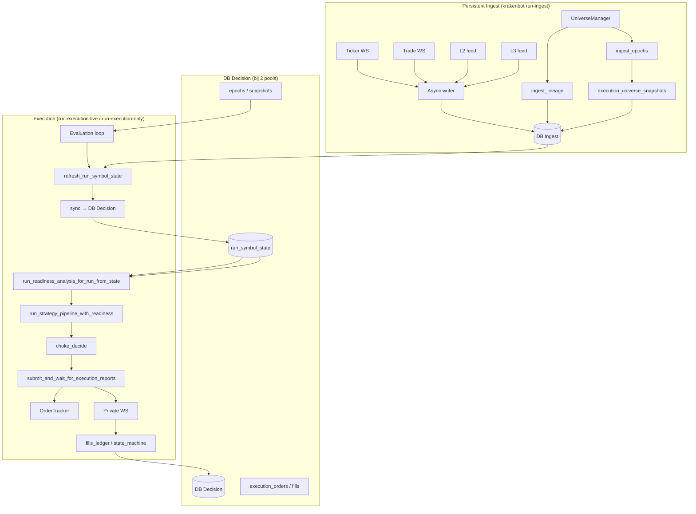
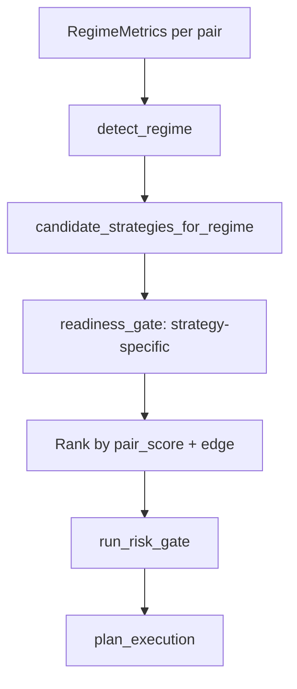
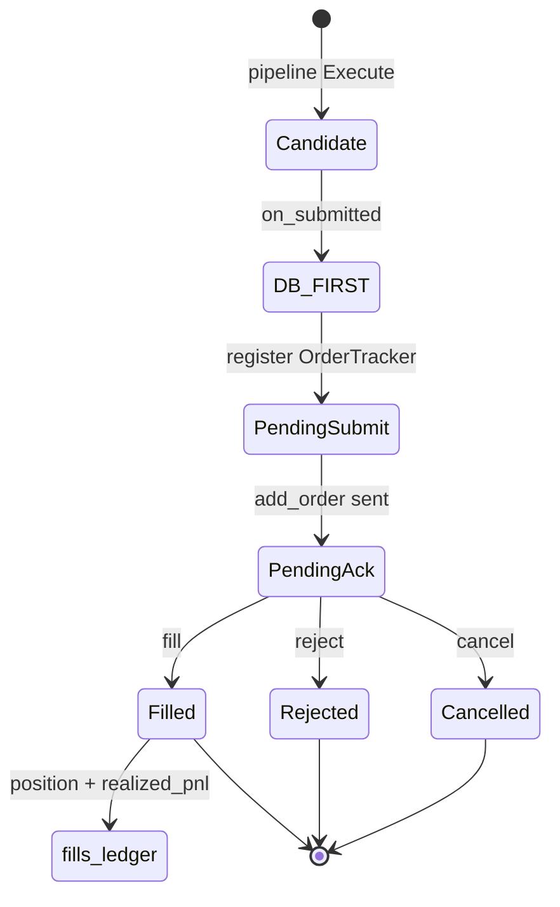

## 2026-03-27 Alignment Addendum

- **MSP gating is asymmetric by design:**
  - `entry_eligible` is a **hard runtime gate** (fail-closed). No Redis/MSP state => no new entries.
  - `exit_eligible` and `protection_eligible` are **soft runtime hints / permissive guards** used for observability and context; exits/protection are not hard-blocked by missing MSP.
- **Position monitor behavior:** exits/protection continue to run on direct `price_cache` + DB execution truth; MSP adds context only (no control-flow blockade).
- **check_symbol_execution_lock is hybrid:** MSP for expected exposure/drift/halt context; DB/WS truth remains authoritative for open orders and hard safety state.
- **Dual-read policy:** DB/WS fallback paths are intentionally retained for one release-cycle validation with mismatch logging, then removable after stable evidence.
- **DB split wording:** dual-DB is **operationally required in production**; single-pool is not supported by runbook/SRE procedure even where code can still be configured permissively.
# Architecture — Current Engine Status

DOC_STATUS: CURRENT  
DOC_ROLE: engine_architecture  

**Rol van dit document:** Huidige, echte architectuur van de Krakenbot-engine. Geen roadmap; alleen wat in code aanwezig is en runtime actief is. Leidend document voor architectuur is [ENGINE_SSOT.md](ENGINE_SSOT.md); dit document werkt de details uit.

---

## 1. Overzicht

Kraken spot **queue-aware hybrid maker** bot met multiregime/multistrategy pipeline, deterministic execution lifecycle, en optionele **persistent ingest** vs **execution attach** (split mode).

- **Geen dry-run, geen paper trading.** One production path; Kraken docs and live payloads only.
- **Ingest:** `run-ingest` — persistent WS (ticker/trade/L2/L3), universe manager, epoch/snapshot publish.
- **Execution:** `run-execution-live` (met eigen ingest) of `run-execution-only` (bind to bestaande epochs; `EXECUTION_ONLY=true` met `run-execution-live` wordt **afgewezen** door `execution_runtime_verify`).

---

## 2. Runtime topology

**Dubbele DB (verplicht, operationeel afgedwongen):** Twee pools: **DB Ingest** (`INGEST_DATABASE_URL`, raw + refresh) en **DB Decision** (`DECISION_DATABASE_URL`, state gesynct, epochs, snapshots, execution). Execution leest alleen van DB Decision; ingest schrijft alleen op DB Ingest; state wordt na refresh gesynct. Bij startup valideert de binary per pool `current_database()` tegen de URL en weigert start als (a) URLs identiek zijn, (b) URL-db ≠ `current_database()`, of (c) ingest- en decision-sessies dezelfde live triple (`current_database` + `inet_server_addr` + `inet_server_port`) hebben — voorkomt dubbel-role wiring met verkeerde aannames.

```mermaid
flowchart TB
  subgraph Ingest["Persistent Ingest (krakenbot run-ingest)"]
    Ticker[Ticker WS]
    Trade[Trade WS]
    L2[L2 feed]
    L3[L3 feed]
    Writer[Async writer]
    UM[UniverseManager]
    Lineage[ingest_lineage]
    Epoch[ingest_epochs]
    Snap[execution_universe_snapshots]
    Ticker --> Writer
    Trade --> Writer
    L2 --> Writer
    L3 --> Writer
    Writer --> DB_Ingest[(DB Ingest)]
    UM --> Lineage
    UM --> Epoch
    Epoch --> Snap
    Snap --> DB_Ingest
    Lineage --> DB_Ingest
  end

  RefreshState[refresh_run_symbol_state]
  Sync[sync → DB Decision]

  subgraph Decision["DB Decision (bij 2 pools)"]
    DB_Decision[(DB Decision)]
    State_D[(run_symbol_state)]
    Epoch_D[epochs / snapshots]
    ExecTables[execution_orders / fills]
  end

  subgraph Execution["Execution (run-execution-live / run-execution-only)"]
    EvalLoop[Evaluation loop]
    Readiness[run_readiness_analysis_for_run_from_state]
    Pipeline[run_strategy_pipeline_with_readiness]
    Choke[choke_decide]
    Submit[submit_and_wait_for_execution_reports]
    OT[OrderTracker]
    WS_Private[Private WS]
    EvalLoop --> RefreshState
    RefreshState --> Sync
    Sync --> State_D
    State_D --> Readiness
    Readiness --> Pipeline
    Pipeline --> Choke
    Choke --> Submit
    Submit --> OT
    Submit --> WS_Private
    WS_Private --> Fills[fills_ledger / state_machine]
    Fills --> DB_Decision
  end

  DB_Ingest --> RefreshState
  State_D --> Readiness
  Epoch_D --> EvalLoop
```

**Systemd (operationeel):**

- `krakenbot-ingest.service` — persistent ingest (run-ingest).
- `krakenbot-execution.service` — execution (run-execution-live of run-execution-only).
- Zie [systemd/README.md](../systemd/README.md).

---

## 3. Data flow

**Live path (state-first):** Geen raw in hot path. Per evaluation: `refresh_run_symbol_state` op **DB Ingest** → bij 2 pools `sync_run_symbol_state_to_decision` naar **DB Decision** → readiness en pipeline lezen alleen uit state op **DB Decision**; execution alleen als generation_id op decision gelijk is aan cycle generation (gate). Orders/fills naar DB Decision.

```mermaid
flowchart LR
  WS[Public WS] --> Writer[writer]
  Writer --> DB_Ingest[(DB Ingest: raw)]
  DB_Ingest --> Refresh[refresh_run_symbol_state]
  Refresh --> Sync[sync]
  Sync --> State_D[(state op DB Decision)]
  State_D --> Readiness[readiness from state]
  Readiness --> Pipeline[strategy_pipeline]
  Pipeline --> Gate[generation + route freshness]
  Gate --> Outcomes[Execute / Skip]
  Outcomes --> Runner[runner: 1st Execute]
  Runner --> DBFirst[on_submitted]
  DBFirst --> Kraken[Kraken add_order]
  Kraken --> PrivateWS[Private WS]
  PrivateWS --> OrderTracker[OrderTracker]
  PrivateWS --> Fills[fills_ledger]
  Fills --> DB_Decision[(DB Decision)]
```

**Epoch/lineage:**

- Ingest: `create_lineage` → `create_epoch` → `insert_execution_universe_snapshot` → `update_epoch_status` (valid/degraded/invalid). Bij `DECISION_DATABASE_URL`: dual-write naar decision-pool.
- Execution: per cycle `current_valid_epoch_id` (of `current_epoch_for_exit_only`) + snapshot; leest state/epoch/snapshot van decision-pool bij fysieke scheiding.
- **Raw tabellen:** ticker_samples, trade_samples, l2_snap_metrics, l3_queue_metrics zijn gepartitioneerd (PARTITION BY RANGE (run_id)); retention via DELETE WHERE run_id.

---

## 4. Strategy flow

```mermaid
flowchart TB
  Metrics[RegimeMetrics per pair]
  Regime[detect_regime]
  Strategies[candidate_strategies_for_regime]
  ReadinessGate[readiness_gate: strategy-specific]
  Rank[Rank by pair_score + edge]
  Risk[run_risk_gate]
  Plan[plan_execution]
  Metrics --> Regime
  Regime --> Strategies
  Strategies --> ReadinessGate
  ReadinessGate --> Rank
  Rank --> Risk
  Risk --> Plan
```

- **Regimes (duaal systeem):**
  - `detect_regime` → `MarketRegime` (RANGE, TREND, HIGH_VOLATILITY, LOW_LIQUIDITY, CHAOS) — readiness + strategy fan-out (`analysis/regime_detection.rs`).
  - `classify_regime` → `MarketRegimeType` — V2 adaptive route engine (`edge_engine/market_regime.rs`).
- **Strategies:** Liquidity, Momentum, Volume, NoTrading (`pipeline/strategy_selector.rs`). CHAOS → lege lijst.
- **Readiness:** Per pair tradable + één dominante blocker; strategy-specific checks (`trading/readiness_gate.rs`).
- **Pipeline:** V2 route analysis → adaptive candidates → edge/expectancy → rank → risk_gate → plan. **Top-1:** live neemt eerste Execute outcome via `flow_poller`.
- **Bekende gap:** `execution_orders.regime` kolom bestaat maar wordt nooit gevuld bij insert.

---

## 5. Execution lifecycle

```mermaid
stateDiagram-v2
  [*] --> Candidate: pipeline Execute
  Candidate --> DB_FIRST: on_submitted
  DB_FIRST --> PendingSubmit: register OrderTracker
  PendingSubmit --> PendingAck: add_order sent
  PendingAck --> Filled: fill
  PendingAck --> Rejected: reject
  PendingAck --> Cancelled: cancel
  Filled --> fills_ledger: position + realized_pnl
  Rejected --> [*]
  Cancelled --> [*]
  Filled --> [*]
```

- **DB-first:** Order row (execution_orders) vóór exchange submit. Market orders krijgen automatisch `deadline = now + 5s` (D2).
- **OrderTracker:** Runtime cache; ws_handler update op ACK/FILL/REJECT/CANCEL. Kraken WS v2 strict semantics (B1): `exec_type == "trade"` voor fills, `status == "filled"` voor completion.
- **fills_ledger:** VWAP-fix (A1), fee-inclusive realized PnL (A2), fill price zero-guard (A3), CTE single-roundtrip (E3). Single serde parse in private_ws_hub (E2).
- **Pricing:** Uitsluitend `price_cache` (WS-fed) met staleness guards (`snapshot_fresh`, `last_price_fresh`); **nul REST in runtime hot path** (D1). Universe discovery via instrument WS cache (D5).
- **Exit:** Post-fill: `run_post_fill_exit_phase` plaatst trailing-stop (optioneel via OTO conditional D4) + optioneel maker TP. **Cancel-first exit** (B2): cancel bescherming → wait-for-cancel-or-fill → market exit op balance-qty genormaliseerd via `normalize_exit_qty` (F3). `RecvResult` (F2) onderscheidt channel close vs timeout. `position_monitor` (spawn in live runner) scant posities, trail SL, TP bij market. Broadcast lag recovery (B4). Zie exit_lifecycle, position_monitor, [HERSTELPLAN_LEAKAGE.md](HERSTELPLAN_LEAKAGE.md).

---

## 6. Module status (actueel)

| Module | Status | Notes |
|--------|--------|------|
| observe/ | Niet wijzigen | Runner, feeds, writer, persistence. |
| exchange/kraken_public | Niet wijzigen | Public WS. |
| db/writer | Niet wijzigen | Async writer. |
| analysis/ | Ready | Regime, readiness, edge_score, cost_breakdown, fill_probability, slippage. |
| pipeline/strategy_pipeline | Ready | Load → edge → entry_filter → readiness → rank → risk_gate → outcomes. |
| pipeline/strategy_selector | Ready | Regime → candidate strategies. |
| trading/readiness_gate | Ready | Strategy-specific tradable/blocker. |
| trading/execution_planner | Ready | queue_decision, plan_execution. |
| execution/ | Ready | Runner, live_runner, ingest_runner, OrderTracker, fills_ledger, state_machine, exit, exit_lifecycle, position_monitor. |
| risk/ | Ready | risk_gate, capital_allocator (live equity per eval; compounding), capital_model (allocated niet uit positions in pipeline). |
| db/ingest_epoch | Ready | Lineage, epochs, snapshots, criteria. |

---

## 7. Statusmatrix

Zie [ENGINE_SSOT.md](ENGINE_SSOT.md) sectie 7 voor de volledige statusmatrix (in code / runtime actief / server bewezen / eindoordeel).

**Dead code (geïdentificeerd, niet in live path):** `ExitManager` (`trading/exit_manager.rs`) en `MomentumContext` (`trading/momentum_strategy.rs`) zijn niet gekoppeld aan enig live execution pad. "Armed" en "triggered" exit via ExitManager FSM bestaan alleen als ongebruikte code; exchange `triggered` status (trailing-stop trigger) wordt wél verwerkt via `exit_lifecycle` / `ws_handler`.

---

## MSP Update (2026-03-27)

- Unified `market_state_projection` toegevoegd op **decision DB** als runtime projection.
- Redis runtime read-layer actief via `msp:{symbol}` + `msp:_symbols`.
- `flow_execution`, `protection_flow`, `position_reconcile`, `exposure_reconcile`, `position_monitor` zijn gekoppeld aan MSP events/read-path.
- Startup pad in `live_runner`: Redis init, DB->Redis rebuild, seed USD symbols, daarna event-driven updates.
- Execution critical path heeft geen ingest DB read dependency toegevoegd.
