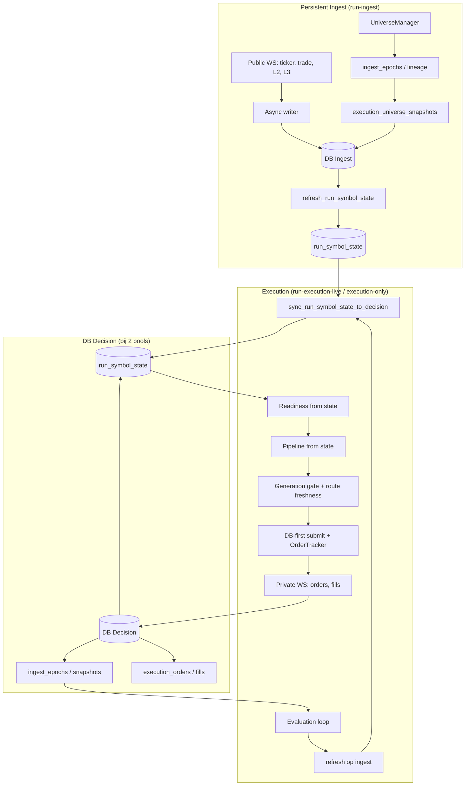

# Engine — Single Source of Truth (SSOT)

DOC_STATUS: SSOT  
DOC_ROLE: engine_ssot  

**Rol van dit document:** De **enige leidende bron** voor de actuele status van de Krakenbot-engine: wat in code zit, wat runtime actief is, wat server-side bewezen is, en wat nog open staat. Bij twijfel: dit document is leidend.

---

## 1. Wat dit document is

- **ENGINE_SSOT.md** = single source of truth voor engine-status.
- Bevat: huidige architectuur-samenvatting, runtime-topology, ingest/execution split, strategy/execution/exit/capital status, validatie-aanpak, en een **statusmatrix** (in code / runtime actief / server bewezen / open).
- Geen roadmap, geen historische varianten; alleen **huidige werkelijkheid** gebaseerd op codebase en gevalideerde server-resultaten.

---

## 2. Ondersteunende documenten

| Document | Rol |
|----------|-----|
| ARCHITECTURE_ENGINE_CURRENT.md | Huidige architectuur (modules, dataflow, strategy flow, execution lifecycle). |
| LIVE_RUNBOOK_CURRENT.md | Operationele flow: persistent ingest, execution attach, start/stop, marker-based validation. |
| VALIDATION_MODEL_CURRENT.md | Soorten validatie (bootstrap, attach, evaluation, lifecycle), economically empty vs data-blocked vs attach-blocked. |
| CHANGELOG_ENGINE.md | Technische changelog uit git, per subsystem. |
| DOC_INDEX.md | Overzicht van alle actuele docs, wat leidend is, wat historisch. |
| LOGGING.md | Loggingstructuur en markers. |
| INGEST_EXECUTION_EPOCH_CONTRACT.md | Epoch/snapshot/lineage contract (referentie). |
| DB_ARCHITECTURE_STALE_EDGE_SAFE.md | State-first, partition, generation, sync; stale-edge prevention. |
| EXECUTION_REPORT_FRESHNESS_AND_500L3.md | Uitgevoerde maatregelen freshness/safety/500 L3. |
| REFRESH_COMPLEXITY_AND_GENERATION.md | Bewijs refresh O(rows); generation contract. |

---

## 3. Historische documenten (niet als waarheid gebruiken)

Documenten in **docs/superseded/** en **docs/archive/** zijn **niet** de actuele bron. Gebruik ze alleen voor historische context.

- architecture.md (vervangen door ARCHITECTURE_ENGINE_CURRENT.md)
- OPLEVERING_PRO_ENGINE_FINAL.md
- DETERMINISTIC_ENGINE_DELIVERABLE.md
- EPOCH_SPLIT_DELIVERABLE.md, EPOCH_CONTRACT_FASE1_VALIDATION_RUNBOOK.md
- LIVE_VALIDATION_RUNBOOK.md (vervangen door LIVE_RUNBOOK_CURRENT.md), LIVE_EXECUTION_MODE_DESIGN.md, LIVE_VALIDATION_PLAN.md
- EXECUTION_* / RUN_EXECUTION_ONCE_AUDIT / SERVER_VALIDATION_LIVE_ENGINE
- ENGINE_TARGET_STATE.md, SINGLE_REGIME_FIX_DELIVERABLE.md

Zie DOC_INDEX.md voor de volledige lijst.

---

## 4. Operationeel leidende documenten

| Onderwerp | Leidend document |
|-----------|------------------|
| Architectuur (huidige status) | **ARCHITECTURE_ENGINE_CURRENT.md** |
| Start/stop, ingest, execution attach, runbook | **LIVE_RUNBOOK_CURRENT.md** |
| Validatiemodel, proof-soorten | **VALIDATION_MODEL_CURRENT.md** |
| Technische wijzigingen (engine) | **CHANGELOG_ENGINE.md** |
| Welk doc waar te vinden | **DOC_INDEX.md** |
| Logmarkers en structuur | **LOGGING.md** |

---

## 5. Onderhoud

- Bij wijzigingen in **runtime-topology**, **strategy**, **execution**, **exit**, **capital** of **validatie**: eerst **ENGINE_SSOT.md** en de statusmatrix bijwerken, daarna desnoods ARCHITECTURE_ENGINE_CURRENT / LIVE_RUNBOOK_CURRENT / VALIDATION_MODEL_CURRENT.
- Nieuwe "bewezen" server-resultaten: statusmatrix kolom **Server bewezen** bijwerken.
- Geen claims toevoegen die niet uit code of uit gevalideerde runs volgen.

---

## 6. Huidige status (samenvatting)

- **Ingest:** Persistent ingest runtime (`run-ingest`): eigen run_id, lineage, public WS (ticker/trade/L2/L3), universe refresh, epoch/snapshot publish. **Raw tabellen** (ticker_samples, trade_samples, l2_snap_metrics, l3_queue_metrics) zijn **gepartitioneerd** (PARTITION BY RANGE (run_id)); writers en refresh gebruiken deze tabellen. Operationeel.
- **DB-pools:** Optioneel **fysieke scheiding** via `DECISION_DATABASE_URL`: ingest-pool (raw writes, refresh) en decision-pool (state/epoch/snapshot/execution reads). Bij scheiding: `sync_run_symbol_state_to_decision` na elke refresh; execution alleen op decision-DB; epoch/snapshot dual-write.
- **State-first live path:** Vóór elke evaluation: `refresh_run_symbol_state` op ingest; daarna readiness, route, pipeline en execution lezen **alleen** uit `run_symbol_state` (geen raw in hot path). Eén **generation_id** per refresh; execution alleen als decision-DB dezelfde generation toont (gate: `EXECUTION_BLOCKED_GENERATION_MISMATCH` bij mismatch).
- **Route-freshness:** Per route-type maximale state-age (30s resp. 45s); `apply_route_freshness_filter` filtert `exec_allowed`; logging: ROUTE_FRESHNESS_OK / ROUTE_FRESHNESS_STALE / ROUTE_EXECUTION_BLOCKED_STALE_DATA.
- **Execution attach:** `EXECUTION_ONLY=true` → execution leest bestaande epochs/snapshots; geen eigen ingest. Split mode operationeel.
- **Regime/strategy:** Per-pair regime (RANGE/TREND/HIGH_VOLATILITY/LOW_LIQUIDITY/CHAOS), strategy fan-out (Liquidity, Momentum, Volume), readiness gate strategy-specifiek. Strategy wordt doorgegeven aan execution.
- **Execution:** DB-first submit, OrderTracker, fills_ledger, deterministic lifecycle. **Top-1:** één order per evaluatie (eerste Execute outcome).
- **Exit:** `submit_exit_order` in code; **geen exit loop** in live runner die posities scant en exit orders plaatst. Geen regime-change exit.
- **Capital:** Pipeline gebruikt vaste equity (default 220); **allocated_quote niet real-time** uit positions. Geen compounding.
- **Validatie:** Marker-based (o.a. EXECUTION_ENGINE_START, LIVE_EVALUATION_*, DATA_INTEGRITY_*, INGEST_EPOCH_*, RUN_SYMBOL_STATE_REFRESH, INGEST_DECISION_SYNC_VISIBLE, ROUTE_FRESHNESS_*). Bootstrap/attach/evaluation/lifecycle proof gedocumenteerd in VALIDATION_MODEL_CURRENT.

---

## 7. Statusmatrix (verplicht)

| Onderdeel | In code | Runtime actief | Server bewezen | Nog open | Opmerking |
|-----------|---------|----------------|----------------|----------|-----------|
| Persistent ingest | Ja | Ja | Te valideren | — | run-ingest; lineage, epochs, snapshots |
| Execution attach | Ja | Ja | Te valideren | — | EXECUTION_ONLY=true, bind to epochs |
| Multiregime | Ja | Ja | Via readiness/logs | — | Per-pair regime in readiness |
| Multistrategy fan-out | Ja | Ja | Idem | — | Liquidity/Momentum/Volume per regime |
| Competitive strategy scoring | Gedeeltelijk | Gedeeltelijk | — | Ranking op pair, niet strategy-vs-strategy | — |
| Portfolio allocation | Scaffolding | Nee | Nee | allocated_quote niet uit positions | CapitalSnapshot in pipeline, niet bijgewerkt |
| Deterministic execution lifecycle | Ja | Ja | Ja | — | DB-first, OrderTracker, fills_ledger |
| Exit runtime wiring | Ja (submit_exit_order) | Nee | Nee | Geen exit loop in live runner | — |
| Armed exit path | In ExitManager/ExitState | In probe | — | Niet in run-execution-live | — |
| Triggered exit path | In code (probe) | In probe | — | Niet in run-execution-live | — |
| Maker fallback | Ja | Ja | — | Queue-aware maker entry | — |
| Compounding | Nee | Nee | Nee | Equity vast 220 | — |
| Marker-based validation infra | Ja | Ja | Ja | — | Log markers + scripts |
| State-first live path | Ja | Ja | Ja | — | refresh vóór evaluation; readiness/pipeline/execution alleen run_symbol_state |
| run_symbol_state + generation_id | Ja | Ja | Ja | — | RefreshOutcome; execution gate op visible generation bij physical separation |
| DbPools / physical separation | Ja | Optioneel | — | — | DECISION_DATABASE_URL; sync state ingest→decision; dual-write epoch/snapshot |
| Raw tables partitioned | Ja | Ja | Ja | — | ticker/trade/l2/l3 PARTITION BY RANGE (run_id); cutover uitgevoerd |
| Route-specific freshness | Ja | Ja | Ja | — | 30s/45s per route; ROUTE_FRESHNESS_* logging; apply_route_freshness_filter |

---

## 8. Runtime topology (diagram)

**Dubbele DB (bij `DECISION_DATABASE_URL`):** ingest schrijft op **DB Ingest**; state wordt na refresh gesynct naar **DB Decision**; execution leest state/epoch/snapshot alleen van **DB Decision** en schrijft orders/fills daar. Zonder `DECISION_DATABASE_URL` zijn het dezelfde pool. **Eis:** DECISION_DATABASE_URL moet wijzen naar een **tweede PostgreSQL-cluster/instance** (eigen poort/datadir); twee DBs of twee pools op dezelfde instance tellen niet als fysieke scheiding.

- **DB Ingest:** raw (ticker/trade/l2/l3 partitioned), refresh, run_symbol_state na refresh. Writer + refresh gebruiken alleen deze pool.
- **DB Decision:** run_symbol_state (gesynct), epochs, snapshots, execution_orders, fills. Execution leest state/epoch/snapshot hier en schrijft orders hier. Bij één pool vallen DB Ingest en DB Decision samen.

---

## 9. Verwijzingen

- **ARCHITECTURE_ENGINE_CURRENT.md** — volledige architectuur, dataflow, strategy flow, execution lifecycle.
- **LIVE_RUNBOOK_CURRENT.md** — start/stop, ingest vs execution-only, marker-based validation, diagnose attach-blocked / data-blocked.
- **VALIDATION_MODEL_CURRENT.md** — bootstrap, attach, evaluation, lifecycle proof; economically empty vs data/attach blocked.
- **CHANGELOG_ENGINE.md** — technische changelog (git-based).
- **DOC_INDEX.md** — index van alle docs.
