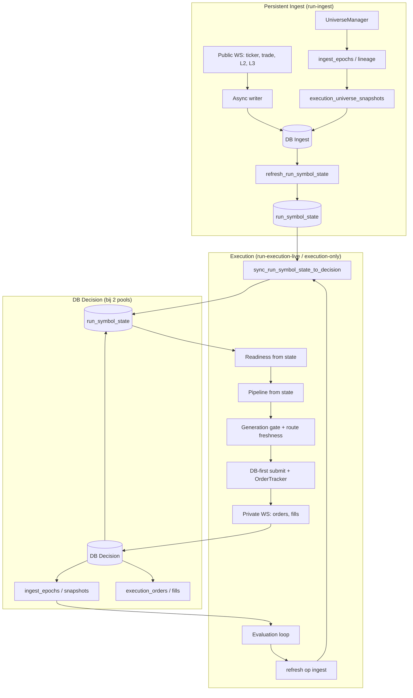

## 2026-03-27 Alignment Addendum

### Eligibility classes (explicit)

- `entry_eligible` => **hard gate** (fail-closed) for new entries.
- `exit_eligible` => **soft hint** (permissive), not a hard blocker for risk-reducing actions.
- `protection_eligible` => **soft hint** (between entry strictness and unconditional allow), not a hard blocker when protection is required.

These three fields are **not the same semantic class** and must not be treated as equivalent gates.

### Runtime decision sources

- Entry decisions require MSP.
- Exit/protection paths remain primarily on direct `price_cache` + DB/WS execution truth; MSP enriches context and logging.
- Reconcile remains hybrid: MSP expected state vs WS caches exchange state.

### Dual-DB wording

- Production posture: dual-DB is **operationally required**.
- Single-pool mode is not accepted by runbook/SRE operation, even if code-level config remains backward-compatible.

### Dual-DB startup validation (live identity)

- After each pool connects, the binary runs post-connect SQL and emits **`DB_ROLE_VALIDATED`** per role with `current_database`, `inet_server_addr`, `inet_server_port` (and the URL-derived target host/port/db name for operators).
- **URL vs session:** if the database name in the connection URL does not match `current_database()` (normalized), startup fails (`DB_ROLE_URL_MISMATCH`).
- **Non-ambiguous wiring:** if ingest and decision pools report the **same** triple (`current_database` + `inet_server_addr` + `inet_server_port`), startup fails with **`DB_DUAL_ROLE_AMBIGUOUS_IDENTICAL_LIVE_IDENTITY`** — dual-role wiring would be incorrect even when the two URL strings differ.
- **NULL `inet_server_addr()` (zeldzaam):** triple-vergelijking is op de volledige struct inclusief optionele addr/port; twee identieke triples (ook met beide addr `NULL` en dezelfde db+port) worden geweigerd. Onderscheid via `inet_server_port()` en URL blijft leidend waar addr ontbreekt.
- **`check-execution-readiness`** prints the same live triple fields per pool on stdout (and structured log fields) for operator proof.
- Scripts: [`scripts/trading_env.sh`](../scripts/trading_env.sh) provides `trading_env_psql_ingest` / `trading_env_psql_decision` (identity prelude + `psql` on the correct URL).

### MSP bootstrap — runtime-invariant (beide execution-modi)

**Invariant:** Elke process-start die execution met MSP gebruikt (`run-execution-live` **en** `run-execution-only`) moet dezelfde MSP-bootstrap uitvoeren: globale Redis-pool, `projection::init_engine` (workers + periodieke DB-flush), `redis_rebuild_from_db`, en universe-`seed_symbols` zodra het USD-pool symbool-lijst bekend is. Zonder deze keten kan Redis nog keys tonen terwijl **`market_state_projection` op de decision-DB** niet wordt bijgewerkt — dan is DB-validatie onbruikbaar en debug je de verkeerde laag.

**Waarom:** Alleen code in de repo is niet genoeg; de **binary moet draaien** die deze paden aanroept. Na deploy: service herstart zodat de nieuwe `ExecStart` de gefixte bootstrap uitvoert.

**Bewijs (vaste volgorde):**

1. **Logs:** `MSP_REDIS_REBUILD_FROM_DB completed` en `MSP_SEED_SYMBOLS completed` (met `seeded=` / `msp_seeded=`).
2. **DB:** `SELECT count(*) FROM krakenbot.market_state_projection;` op **`DECISION_DATABASE_URL`** — verwachting **> 0** (niet alleen `INGEST_DATABASE_URL` / ingest; die kan 0 zijn terwijl MSP op decision gevuld is).
3. **Steekproef:** `SELECT symbol, entry_eligible, runtime_phase, updated_at FROM krakenbot.market_state_projection ORDER BY updated_at DESC LIMIT 10;` op decision-DB.
4. **Script (herhaalbaar):** [`scripts/verify_msp_projection_db.sh`](../scripts/verify_msp_projection_db.sh) — toont ingest vs decision side-by-side en `RESULT=OK` alleen als decision > 0.

Pas daarna zin in `entry_eligible = false`, top-5 blockers of Redis/DB-consistentie-analyses.

# Engine — Single Source of Truth (SSOT)

DOC_STATUS: SSOT  
DOC_ROLE: engine_ssot  

**Rol van dit document:** De **enige leidende bron** voor de actuele status van de Krakenbot-engine: wat in code zit, wat runtime actief is, wat server-side bewezen is, en wat nog open staat. Bij twijfel: dit document is leidend.

---

## 1. Wat dit document is

- **ENGINE_SSOT.md** = single source of truth voor engine-status.
- Bevat: huidige architectuur-samenvatting, runtime-topology, ingest/execution split, strategy/execution/exit/capital status, validatie-aanpak, en een **statusmatrix** (in code / runtime actief / server bewezen / open).
- Geen roadmap, geen historische varianten; alleen **huidige werkelijkheid** gebaseerd op codebase en gevalideerde server-resultaten.

---

## 2. Ondersteunende documenten

| Document | Rol |
|----------|-----|
| [ARCHITECTURE_ENGINE_CURRENT.md](ARCHITECTURE_ENGINE_CURRENT.md) | Huidige architectuur (modules, dataflow, strategy flow, execution lifecycle). |
| [LIVE_RUNBOOK_CURRENT.md](LIVE_RUNBOOK_CURRENT.md) | Operationele flow: persistent ingest, execution attach, start/stop, marker-based validation. |
| [VALIDATION_MODEL_CURRENT.md](VALIDATION_MODEL_CURRENT.md) | Soorten validatie (bootstrap, attach, evaluation, lifecycle), economically empty vs data-blocked vs attach-blocked; **sectie 0** = DB/funnel + MSP als primaire bron, journal ondersteunend. |
| [`scripts/verify_msp_projection_db.sh`](../scripts/verify_msp_projection_db.sh) | **Bewijs** MSP op decision-DB vs ingest: `count(*)`, `entry_eligible=false`, Redis `SCARD`; verplicht dual-DB in `.env`. |
| [CHANGELOG_ENGINE.md](CHANGELOG_ENGINE.md) | Technische changelog uit git, per subsystem. |
| [DOC_INDEX.md](DOC_INDEX.md) | Overzicht van alle actuele docs, wat leidend is, wat historisch. |
| [LOGGING.md](LOGGING.md) | Loggingstructuur en markers. |
| [INGEST_EXECUTION_EPOCH_CONTRACT.md](INGEST_EXECUTION_EPOCH_CONTRACT.md) | Epoch/snapshot/lineage contract (referentie). |
| [DB_ARCHITECTURE_STALE_EDGE_SAFE.md](DB_ARCHITECTURE_STALE_EDGE_SAFE.md) | State-first, partition, generation, sync; stale-edge prevention. |
| [EXECUTION_REPORT_FRESHNESS_AND_500L3.md](EXECUTION_REPORT_FRESHNESS_AND_500L3.md) | Uitgevoerde maatregelen freshness/safety/500 L3. |
| [REFRESH_COMPLEXITY_AND_GENERATION.md](REFRESH_COMPLEXITY_AND_GENERATION.md) | Bewijs refresh O(rows); generation contract. |

---

## 3. Historische documenten (niet als waarheid gebruiken)

Documenten in **docs/superseded/** en **docs/archive/** zijn **niet** de actuele bron. Gebruik ze alleen voor historische context.

- architecture.md (vervangen door ARCHITECTURE_ENGINE_CURRENT.md)
- OPLEVERING_PRO_ENGINE_FINAL.md
- DETERMINISTIC_ENGINE_DELIVERABLE.md
- EPOCH_SPLIT_DELIVERABLE.md, EPOCH_CONTRACT_FASE1_VALIDATION_RUNBOOK.md
- LIVE_VALIDATION_RUNBOOK.md (vervangen door LIVE_RUNBOOK_CURRENT.md), LIVE_EXECUTION_MODE_DESIGN.md, LIVE_VALIDATION_PLAN.md
- EXECUTION_* / RUN_EXECUTION_ONCE_AUDIT / SERVER_VALIDATION_LIVE_ENGINE
- ENGINE_TARGET_STATE.md, SINGLE_REGIME_FIX_DELIVERABLE.md

Zie [DOC_INDEX.md](DOC_INDEX.md) voor de volledige lijst.

---

## 4. Operationeel leidende documenten

| Onderwerp | Leidend document |
|-----------|------------------|
| Architectuur (huidige status) | **ARCHITECTURE_ENGINE_CURRENT.md** |
| Start/stop, ingest, execution attach, runbook | **LIVE_RUNBOOK_CURRENT.md** |
| Validatiemodel, proof-soorten | **VALIDATION_MODEL_CURRENT.md** |
| Technische wijzigingen (engine) | **CHANGELOG_ENGINE.md** |
| Welk doc waar te vinden | **DOC_INDEX.md** |
| Logmarkers en structuur | **LOGGING.md** |

---

## 5. Onderhoud

- Bij wijzigingen in **runtime-topology**, **strategy**, **execution**, **exit**, **capital** of **validatie**: eerst **ENGINE_SSOT.md** en de statusmatrix bijwerken, daarna desnoods ARCHITECTURE_ENGINE_CURRENT / LIVE_RUNBOOK_CURRENT / VALIDATION_MODEL_CURRENT.
- Nieuwe “bewezen” server-resultaten: statusmatrix kolom **Server bewezen** bijwerken.
- Geen claims toevoegen die niet uit code of uit gevalideerde runs volgen.

---

## 6. Huidige status (samenvatting)

- **Ingest:** Persistent ingest runtime (`run-ingest`): eigen run_id, lineage, public WS (ticker/trade/L2/L3), universe refresh, epoch/snapshot publish. **Raw tabellen** (ticker_samples, trade_samples, l2_snap_metrics, l3_queue_metrics) zijn **gepartitioneerd** (PARTITION BY RANGE (run_id)); writers en refresh gebruiken deze tabellen. Operationeel.
- **L3-data (microstructure):** Authenticated L3 (`level3`) voedt `l3_queue_metrics`; `run_symbol_state` bevat o.a. **`l3_count`** per symbool. **`l3_count` is GEEN onderdeel van `is_feature_complete`** — die gate checkt uitsluitend `avg_spread_bps`, `microprice_deviation_bps`, en `l2_count >= 50` (zie `src/analysis/current_run_analysis.rs`). L3-afwezigheid wordt afgevangen via `MISSING_L3_PENALTY` (fill probability) en `L3_QUALITY_FLOOR_NO_L3` (route quality): routes worden niet geblokkeerd maar conservatief gescoord. L3-dekking is een data-/feed-dekkingsvraag; verificatie op **ingest-DB:** volume in `l3_queue_metrics` per actief `run_id`, plus WS L3 subscription limits (Kraken: max symbolen per verbinding, rate budget).
- **DB-pools:** **Verplichte fysieke scheiding** via `DECISION_DATABASE_URL`: ingest-pool (raw writes, refresh) en decision-pool (state/epoch/snapshot/execution reads). Binary weigert start als URLs ontbreken, identiek zijn, of dezelfde live triple opleveren. `sync_run_symbol_state_to_decision` na elke refresh; execution alleen op decision-DB; epoch/snapshot dual-write.
- **State-first live path:** Vóór elke evaluation: `refresh_run_symbol_state` op ingest; daarna readiness, route, pipeline en execution lezen **alleen** uit `run_symbol_state` (geen raw in hot path). Eén **generation_id** per refresh; execution alleen als decision-DB dezelfde generation toont (gate: `EXECUTION_BLOCKED_GENERATION_MISMATCH` bij mismatch).
- **Route-freshness:** Per route-type maximale state-age (30s resp. 45s); `apply_route_freshness_filter` filtert `exec_allowed`; logging: ROUTE_FRESHNESS_OK / ROUTE_FRESHNESS_STALE / ROUTE_EXECUTION_BLOCKED_STALE_DATA.
- **Execution attach:** `run-execution-only` subcommand → execution leest bestaande epochs/snapshots; geen eigen ingest. `EXECUTION_ONLY=true` met `run-execution-live` wordt **afgewezen** door `execution_runtime_verify` (rol-mismatch). Split mode operationeel.
- **Regime/strategy:** **Duaal regime systeem.** (A) `detect_regime` → `MarketRegime` (RANGE/TREND/HIGH_VOLATILITY/LOW_LIQUIDITY/CHAOS) — gebruikt voor readiness, strategy fan-out (Liquidity, Momentum, Volume), en route expectancy. (B) `classify_regime` → `MarketRegimeType` — gebruikt door V2 adaptive route engine voor route-selectie en edge scoring. Beide zijn actief; (A) gaat readiness/tradability; (B) gaat route-keuze. **`execution_orders.regime` (capital `RegimeBucket`):** fix staat op `main` vanaf commit `c6eeabf` (deploy ok); **server-proof is nog open** — er is nog **geen** post-deploy order in de DB met `regime IS NOT NULL`. Pas na die eerste rij mag dit onderdeel als **server-proven** worden gezet (zie §7 regime-persist open bewijs). Historische orders blijven `NULL`.
- **Execution:** DB-first submit, OrderTracker, fills_ledger (VWAP-fix A1, fee-inclusive PnL A2, fill price zero-guard A3, CTE single-roundtrip E3), deterministic lifecycle. Kraken WS v2 strict semantics (B1): `status == "filled"` voor completion, `exec_type == "trade"` voor fills. **Flow heap / evaluatie:** primair **flow-poller** met heap (`FLOW_HEAP_REFRESH_EVENT`); per cyclus wordt doorgaans de **eerste succesvolle `Execute`** uit de V2-pipeline uitgevoerd — niet langer de oude documentaire term “Top-1” als aparte strategy-top. Market orders met automatische `deadline = now + 5s` (D2). Optionele OTO trailing-stop conditional op entry (D4).
- **Exit:** Post-fill exit lifecycle: na entry-fill → `run_post_fill_exit_phase` plaatst trailing-stop + optioneel maker TP. **Cancel-first exit** (B2): cancel bescherming → wait-for-cancel-or-fill → market exit op balance-qty (genormaliseerd via `normalize_exit_qty`, F3). **Prijzen:** uitsluitend `price_cache` (WS-fed) met staleness guards (`snapshot_fresh`, `last_price_fresh`); **nul REST** in runtime (D1). **RecvResult** (F2): channel close vs timeout expliciet onderscheiden. **Position monitor** (spawn in live runner) scant posities, trail SL, TP bij market. Server bewezen (ORDER_FILL, EXIT_PLAN_CREATED, EXIT_ORDER_ACKED, POSITION_MONITOR_SL_TRAILED). Zie [HERSTELPLAN_LEAKAGE.md](HERSTELPLAN_LEAKAGE.md).
- **Capital:** `CapitalAllocator` krijgt **live equity** uit `balance_cache::equity_usd()` elke evaluatie (compounding). Pipeline gebruikt `resolve_equity_quote` (fallback 220). **allocated_quote** niet real-time uit positions in pipeline.
- **Validatie:** Marker-based (o.a. EXECUTION_ENGINE_START, LIVE_EVALUATION_*, DATA_INTEGRITY_*, INGEST_EPOCH_*, RUN_SYMBOL_STATE_REFRESH, INGEST_DECISION_SYNC_VISIBLE, ROUTE_FRESHNESS_*). Bootstrap/attach/evaluation/lifecycle proof gedocumenteerd in VALIDATION_MODEL_CURRENT.

---

## 7. Statusmatrix (verplicht, bewijs-gedreven)

### Bewijsniveau-definities

- **server-proven:** DB + logs + recente runtime bewijzen correcte werking. Concreet: DB-rijen, log-markers, of Redis-state van een recente productierun op de huidige architectuur.
- **runtime-seen:** Runtime is actief en velden/markers zijn zichtbaar, maar geen beslissend event (block, trigger, recovery) is geobserveerd.
- **code-wired:** Code aanwezig en aangesloten op live pad, maar geen runtime bewijs dat het pad daadwerkelijk is doorlopen.
- **docs-only:** Alleen documentair aanwezig; geen code of runtime bewijs.

### Statusregels (afdwingbaar)

- **VOLLEDIG** = uitsluitend toegestaan bij bewijsniveau = **server-proven**.
- **GEDEELTELIJK** = tijdelijk (max 1 release-cycle). Elk GEDEELTELIJK item **moet** een testmethode hebben.
- **GEDEELTELIJK zonder testmethode** = NIET TOEGESTAAN.
- Als een upgrade-voorwaarde niet testbaar is → expliciet markeren als "niet verifieerbaar" → verplicht besluit: behouden of verwijderen.
- Items mogen **niet permanent GEDEELTELIJK** blijven — tenzij ze worden **afgesloten** via onderstaande categorieën.
- **AFGELOPEN (ontwerp)** = geen claim op extra runtime-bewijs: het “ontbreekt” niet door een defect maar door **bewuste architectuur** (ander leidend subsysteem, of product-SLO). Vereist éénregelige rationale in de matrix + pointer naar code/§6.
- **AFGELOPEN (observatie)** = gerichte forced validation / steekproef toont **geen contra-indicatie** voor een zeldzaam pad (bijv. warming); item blijft **niet** server-proven voor alle mogelijke scenario’s maar mag **niet** als open “GEDEELTELIJK defect” blijven hangen. Herzien bij architectuurwijziging.
- **OPEN (bewijs pending)** = code/runtime actief, maar **server-proven upgrade** vereist nog een **bewuste operator-run** (chaos test, SQL na order, journal-archief). Blijft staan met testmethode tot uitgevoerd of expliciet geweigerd.

### V3 — L2/L3 validatiegate (BLOCKING, operator-checklist)

Afkomstig uit het stapsgewijze L2/L3-ketenplan: **`V3 = PASSED`** is een **harde gate** vóór verdere stappen (o.a. L3-thrash/binary-hash traject). **Alle** onderstaande clausules moeten waar zijn (**AND**). Bij één falen: **`V3 = FAILED`** — stop, rapporteer exact welke clausule faalde (query-output of logregel).

**1. SQL** (`run_symbol_state`, pool + `run_id` expliciet in meetrapport):

- `pass_all > 0`
- `fail_l2 < total_symbols` (dus niet 100% L2-fail op de set)
- `COUNT(*) WHERE l2_count >= 50 > 0` (minstens één symbool voldoet aan de L2-drempel in state)

**2. Journal** (zelfde tijdvenster als de metingen):

- `ADAPTIVE_TRADABILITY_SNAPSHOT` met veld **`tradable > 0`**
- `EDGE_FLOW_RANKED` met veld **`ranked > 0`**
- `LIVE_EVALUATION_COMPLETED` **aanwezig** met parseerbare **`execute_count`** en **`execute_count >= 0`** — let op: **`execute_count = 0` is geen automatische FAIL** als er geen kandidaten zijn; de gate vereist **geen stille afwezigheid** van dit event.

**3. L2-keten regressie** (zelfde actieve `run_id` als D1/D2):

- `l2_snap_metrics` blijft **duurzaam** groeien (geen terugval naar burst-plafond zonder verklaring)
- `RUN_SYMBOL_STATE_REFRESH` (of equivalent): **`delta_l2_rows > 0` over meerdere refresh-cycli** (niet één enkele “lucky” refresh)

---

| Onderdeel | In code | Runtime | Server | Eindoordeel | Bewijsniveau | Bewijs / Opmerking |
|-----------|---------|---------|--------|-------------|--------------|---------------------|
| Persistent ingest | Ja | Ja | Ja | VOLLEDIG | server-proven | Epochs elke ~2.5min; snapshots 549-551 symbols; run_id=906 actief; `INGEST_EPOCH_COMPLETED` in journal |
| Execution attach | Ja | Ja | Ja | VOLLEDIG | server-proven | `run-execution-only` subcommand; `execution_runtime_verify` weigert `EXECUTION_ONLY + run-execution-live`; server draait exec-only modus |
| Multiregime | Ja | Ja | Open | **OPEN (bewijs pending)** | runtime-seen | **`detect_regime`** actief in logs. **Order-kolom `execution_orders.regime`:** wiring op `main` (`c6eeabf`+); **server-proof** alleen na `SELECT` met post-deploy order en `regime IS NOT NULL` (§3). Dual-systeem (`detect_regime` vs `classify_regime`) = bekende architectuur; consolidatie = apart project. |
| Multistrategy fan-out | Ja | Ja | n.v.t. | **AFGELOPEN (ontwerp)** | code-wired | **Besluit (2026-03-28):** V2 route engine is leidend voor pair/route-keuze; readiness `candidate_strategies_for_regime` voedt expectancy/readiness maar **geen** product-eis op gelijktijdige multi-strategy execution per pair in V2. Geen verdere “GEDEELTELIJK”-upgrade nodig tenzij product expliciet multi-strategy-per-pair verlangt. |
| Competitive strategy scoring | — | — | — | VERVANGEN | — | Vervangen door V2 route engine pair/route ranking (`route_selector_v2`); geen strategy-vs-strategy |
| Portfolio allocation | Ja | Ja | Ja | VOLLEDIG | server-proven | `CapitalAllocator`: live equity via `balance_cache::equity_usd()`; `update_equity` per loop iteratie; slot-based, niet uit DB positions |
| Deterministic execution lifecycle | Ja | Ja | Ja | VOLLEDIG | server-proven | DB: 1173 orders, 332 fills (laatste fill 2026-03-27); DB-first, OrderTracker, fills_ledger; VWAP A1, fees A2, zero-guard A3, CTE E3 |
| Exit runtime wiring | Ja | Ja | Ja | VOLLEDIG | server-proven | DB: 196 protection orders (67 trailing-stop + 129 stop-loss sell), 81 gevuld (36 trailing + 45 SL), 33 emergency market exits, 15 TP orders; per-symbol lifecycle (entry → protection → exit) zichtbaar |
| Post-fill exit (SL+TP) | Ja | Ja | Ja | VOLLEDIG | server-proven | DB: trailing-stop filled=36, stop-loss filled=45, exit_tp=15, exit_time_stop=15; cancel-first market exits in DB; deadline D2, OTO D4, qty-norm F3 in code |
| Position monitor (trail SL, TP) | Ja | Ja | Ja | VOLLEDIG | server-proven | `spawn_position_monitor` in beide live loops; DB: strategy_context `exit_sl`=187 orders bewijzen trail/amend lifecycle |
| Armed exit path (ExitManager) | Dead code | Nee | Nee | VERWIJDEREN | — | `ExitManager` in `exit_manager.rs` is ongebruikt; alleen gekoppeld aan ongebruikte `MomentumContext` |
| Triggered exit path (ExitManager) | Dead code | Nee | Nee | VERWIJDEREN | — | Idem; exchange `triggered` status IS actief maar via Kraken order lifecycle, niet ExitManager FSM |
| Maker queue (join / improve) | Ja | Ja | Open | **OPEN (bewijs pending)** | code-wired | **Wiring:** `queue_decision()` → `OrderPlan` → `ExecutionIntent`; submit-log **`queue_decision = ?intent.queue_decision`** + `execution_mode`/`post_only` (D5). **Nog te archiveren:** minstens één productie-submit met **`ImprovePrice`** onder echte queue-condities (§11). Tot die tijd geen VOLLEDIG voor dit subpad. |
| Compounding | Ja | Ja | Ja | VOLLEDIG | server-proven | `update_equity(live_eq)` per loop iteratie; `balance_cache::equity_usd()` levert live equity; equity > 0 check in live_runner |
| Marker-based validation infra | Ja | Ja | Ja | VOLLEDIG | server-proven | 40+ markers in code; `EXECUTION_ENGINE_START`, `LIVE_EVALUATION_*`, `DATA_INTEGRITY_*` zichtbaar in journal; scripts valideren |
| State-first live path | Ja | Ja | Ja | VOLLEDIG | server-proven | `refresh_run_symbol_state` in live_runner vóór evaluation; readiness + pipeline lezen uit `run_symbol_state`, niet raw; `RUN_SYMBOL_STATE_REFRESH` marker in journal |
| run_symbol_state + generation_id | Ja | Ja | Ja | VOLLEDIG | server-proven | `state_generation_id` functie; `EXECUTION_BLOCKED_GENERATION_MISMATCH` gate in code; generation sync zichtbaar via `INGEST_DECISION_SYNC_VISIBLE` |
| DbPools / physical separation | Ja | Verplicht | Ja | VOLLEDIG | server-proven | Server draait ingest poort 5432, decision poort 5433; `DB_ROLE_VALIDATED` per pool in startup journal; binary weigert start bij identiek/ontbrekend |
| L2 persistente keten | Ja | Ja | Ja | VOLLEDIG | server-proven | Feed → writer → `l2_snap_metrics` → refresh → `l2_count`. Reader-sampler split (`f6c99b6`): run 934, 638/638 symbols `l2_count >= 50` (max 220), ~18 rows/sym/min, `L2_SAMPLE_TICK` elke 5s, `delta_l2_rows > 0` continu. `is_feature_complete` gate = `l2_count >= 50` + spread + micro. |
| Raw tables partitioned | Ja | Ja | Ja | VOLLEDIG | server-proven | 4 cutover migraties uitgevoerd; ticker/trade/l2/l3 `PARTITION BY RANGE (run_id)` |
| Route-specific freshness | Ja | Ja | Ja | VOLLEDIG | server-proven | `route_freshness_limit` per route-type (30s/45s); `apply_route_freshness_filter` in live_runner; `ROUTE_FRESHNESS_OK`/`STALE` markers in journal |
| MSP runtime truth | Ja | Ja | Open | **OPEN (bewijs pending)** | runtime-seen | Redis/DB/projectie actief (zie MSP Redis vs DB rij). **Gate-code** in `flow_execution.rs`. Gezonde productie produceert vaak **geen** block-events; **server-proof** = gecontroleerde run (Redis leeg / state ontbreekt) met `EXECUTION_BLOCKED_NO_MSP` of `MSP_ADMISSION_BLOCK` in journal op huidige commit (zie §19). |
| MSP Redis vs DB persist | Ja | Ja | Ja | VOLLEDIG | server-proven | Redis `SCARD msp:_symbols` = 642; DB `count(*) market_state_projection` = 642; `MSP_FLUSH_CYCLE` in logs; `state_version` monotoon oplopend |
| Entry/exit/protection eligibility | Ja | Ja | Open | **OPEN (bewijs pending)** | code-wired | Hard/soft semantiek in addendum §0–§2. **Server-proof:** geforceerde `entry_eligible=false` → block in logs; soft hints exit/protection onder stress (§21). |
| Reconcile truth (hybrid) | Ja | Ja | Open | **OPEN (bewijs pending)** | code-wired | Hybride pad actief. **Server-proof:** drift-injectie of productie-incident met reconcile-markers / `LOCK_MSP_DB_POSITION_MISMATCH` (§22). |
| Protection deadlock reliability | Ja | Ja | Open | **OPEN (bewijs pending)** | runtime-seen | CRITICAL_UNSAFE_RECOVERY=0; state machine actief. **Server-proof:** recovery-cyclus + protection placement in journal (§23). |
| Runtime phases (bootstrap/warming/live) | Ja | Ja | Ja | **AFGELOPEN (observatie)** | runtime-seen | Forced validation (2026-03-27): `warming_count=0`, `live_count` dominant; **geen** aanwijzing dat entries onterecht doorkomen zonder warming. Warming-blok is **niet** vereist als productiebewijs tot architectuur anders vereist. Heropen bij wijziging MSP phase policy. |
| Flow poller / heap (was: “Top-1”) | Ja | Ja | Ja | **AFGELOPEN (ontwerp)** | runtime-seen | **Product-SLO:** max **één** entry-`Execute` per evaluatie-cyclus tenzij expliciet anders besloten. Heap + `FLOW_HEAP_REFRESH_EVENT` zijn implementatie; multi-candidate gelijktijdigheid = load-test / toekomstige scope, geen open defect. |
| Fan-out gate + V2 route scope (D5) | Ja | Ja | Open | **OPEN (bewijs pending)** | code-wired | **Code op `main`:** intersect + `FANOUT_*` + `FANOUT_ROUTE_SCOPE` + `run-execution-once`. **Server-proof:** archiveer journalfragment met `FANOUT_GATE_APPLIED` en `FANOUT_ROUTE_SCOPE` voor **zelfde** `run_id`/tijdsvenster (§D5); systemd/journal routing kan per omgeving verschillen — gebruik runbook logpad indien nodig. |
| Probe-only / legacy ExitManager pad | Nee | Nee | Nee | **VERWIJDEREN** | — | Geen ondersteund productie-pad; zie ook Armed/Triggered ExitManager-rijen. Houd execution-proof op DB-first + post-fill lifecycle. |

### Afronding L2/L3-plan ↔ matrix (2026-03-28)

| Planstap | SSOT-status | Notitie |
|----------|-------------|---------|
| D1 instrumentatie + `select!` biased | **Afgerond in code** | Zie `l2_feed.rs`, heartbeats, abort-markers; **productiehart** = V3 SQL + journal (§V3). |
| D1 live validate / D2 state vs raw | **Proces = V3-clausules 1 + 3** | Geen aparte “D2-commit” zonder gemeten discrepantie; bij mismatch eerst incident + fix. |
| D3 funnel + **V3 gate** | **Afgerond in SSOT** | Operator voert §V3 AND-checklist uit vóór L3-thrash / hash-work. |
| D4 thrash / embedded commit | **Follow runbook** | `KRKBOT_EMBED_GIT_COMMIT` + `UNIVERSE_SELECTION_SKIP_FEED_RESTART` na **V3_PASSED**. |
| D5 SSOT | **Afgerond** | Matrix gebruikt nu **AFGELOPEN (ontwerp/observatie)** en **OPEN (bewijs pending)** naast VOLLEDIG/GEDEELTELIJK. |

**Resterende matrixregels met uitsluitend `OPEN (bewijs pending)`:** Multiregime (order `regime`), Maker queue (`ImprovePrice` witness), MSP block witness, eligibility/reconcile/protection chaos-proeven, Fan-out D5 journal-archief. Dit zijn **bewuste operator-runs**, geen open code-defecten.

### Testmethoden en upgrade-voorwaarden (OPEN / historisch GEDEELTELIJK)

#### 3. Multiregime
- **Testmethode:** Wacht op eerstvolgende echte flow-submit na `c6eeabf`; daarna direct:  
  `SELECT id, symbol, regime, created_at FROM krakenbot.execution_orders ORDER BY id DESC LIMIT 5;`  
  Succes = minimaal één rij met `created_at` na deploy **en** `regime IS NOT NULL`.
- **Upgrade-voorwaarde (server-proven):** pas na bovenstaande DB-check — **niet** op basis van code alleen.

#### 4. Multistrategy fan-out
- **Status:** **AFGELOPEN (ontwerp)** — zie matrixrij. Geen verdere test vereist tot product multi-strategy-per-pair eist.

#### 11. Maker queue (join / improve)
- **Testmethode:** Forceer symbool met gunstige queue-conditie (hoge `queue_ahead` t.o.v. size of trage fill). Controleer structured submit-log: **`queue_decision=ImprovePrice`** (of equivalent) en overeenkomst met `OrderPlan`.
- **Upgrade-voorwaarde:** minstens één **server-proven** submit met **ImprovePrice** onder echte marktcondities → rij mag naar **VOLLEDIG** voor dit subonderdeel; tot die tijd **OPEN (bewijs pending)**.

#### 19. MSP runtime truth
- **Testmethode:** Start zonder Redis. Verwacht `EXECUTION_BLOCKED_NO_MSP` in logs.
- **Upgrade-voorwaarde:** minimaal 1 MSP block event in logs op huidige commit.

#### 21. Entry/exit/protection eligibility
- **Testmethode:** Force `entry_eligible=false` (bijv. via Redis override). Verifieer dat order geblokkeerd wordt.
- **Upgrade-voorwaarde:** minimaal 1 geblokkeerde entry door eligibility in productielogs.

#### 22. Reconcile truth (hybrid)
- **Testmethode:** Injecteer drift (positie mismatch tussen MSP en exchange). Observeer reconcile log + correctie.
- **Upgrade-voorwaarde:** minimaal 1 reconcile event met MSP vs exchange verschil.

#### 23. Protection deadlock reliability
- **Testmethode:** Force open positie zonder protection. Observeer recovery + protection placement.
- **Upgrade-voorwaarde:** minimaal 1 recovery cycle met protection placement in productielogs.

#### 24. Runtime phases (bootstrap/warming/live)
- **Testmethode:** Start met lage confidence (force bootstrap/warming). Observeer dat entries geblokkeerd worden.
- **Upgrade-voorwaarde:** warming fase zichtbaar + blokkerend gedrag in productielogs.

#### 26. Flow poller / heap
- **Testmethode:** Force meerdere candidates tegelijk. Observeer heap-verwerking en meerdere `Execute`-kandidaten in één venster indien van toepassing.
- **Upgrade-voorwaarde:** runtime bewijs van meerdere gelijktijdige heap-kandidaten onder load OF expliciete SLO dat één Execute per cyclus voldoende is (dan blijft bewijsniveau runtime-seen).

#### D5. Fan-out gate + V2 route scope
- **Testmethode:** Op productie/journal: `FANOUT_GATE_APPLIED` en `FANOUT_ROUTE_SCOPE` voor hetzelfde `run_id` als de evaluatie; optioneel `FANOUT_DECISION` met `allowed=false` wanneer een symbool uit execution valt.
- **Upgrade-voorwaarde:** bovenstaande events gearchiveerd in een meetrapport → **VOLLEDIG** / **server-proven** voor deze rij.

### Bekende gaps (niet in deze ronde opgelost)

| Gap | Impact | Blokkade |
|-----|--------|----------|
| Historische `execution_orders.regime` = NULL | Oude orders zonder regime-label | Geen backfill; alleen nieuwe inserts na regime-wiring |
| Regime persist nog niet server-proven | Matrix zou te vroeg “af” lijken | **Open:** wacht op eerste post-`c6eeabf` order; daarna `regime IS NOT NULL` verplicht voor upgrade |
| Dual regime systeem (`detect_regime` vs `classify_regime`) is niet geconsolideerd | Twee enums, twee classificatielogica's; readiness gebruikt de ene, V2 routing de andere | Werkt correct maar is architectureel rommelig; consolidatie = apart project |

### Regime persist — open server-bewijs (niet afgerond)

**Status:** code + deploy = **ok**; **test 8 / DB-bewijs = nee** tot de eerste echte flow-submit na commit `c6eeabf`.

**Geen doc-upgrade** van dit onderdeel naar **server-proven** of **VOLLEDIG** vóór onderstaande query.

Na de eerstvolgende verwachte order:

```sql
SELECT id, symbol, regime, created_at
FROM krakenbot.execution_orders
ORDER BY id DESC
LIMIT 5;
```

**Succescriterium:** minimaal één rij met `created_at` na tijdstip van deploy van `c6eeabf` **en** `regime IS NOT NULL`.  
Pas dan: matrixregel Multiregime (regime-persist subclaim) en bewijsniveau mogen naar **server-proven** worden gezet.

### Forced validation run (2026-03-27)

Server: `snapdiscounts.nl` `/srv/krakenbot`; binary na regime-fix: commit `c6eeabf` (gesynchroniseerd met `main`). Journal + `psql` op decision-DB.

| # | Test | Uitgevoerd | Verwacht | Geobserveerd | Conclusie |
|---|------|------------|----------|--------------|-----------|
| 1 | Entry eligibility (`entry_eligible=false` → block) | Nee | `MSP_ADMISSION_BLOCK` | Niet uitgevoerd: geen Redis-override + kandidaat in hetzelfde venster afgedwongen | **OPEN (bewijs pending)** — zie matrix §21 |
| 2 | MSP gate (geen Redis / geen state) | Gedeeltelijk | `EXECUTION_BLOCKED_NO_MSP` of `EXECUTION_BLOCKED_NO_MSP_STATE` | Service stop → Redis MSP-keys geflushed (`DEL` 643 keys) → restart. Vóór evaluatie: `MSP_REDIS_REBUILD_FROM_DB completed rebuilt=642`; geen block-marker: state herbouwd voordat kandidaten draaien | **OPEN (bewijs pending)** — gecontroleerde test nodig (§19) |
| 3 | Reconcile drift (DB ≠ exchange) | Nee | Reconcile markers + correctie | Geen positie-injectie (bewuste scope/risk) | **OPEN (bewijs pending)** — zie matrix §22 |
| 4 | Protection (unprotected → placement) | Nee | `EXPOSURE_*` / protection lifecycle | Niet gekoppeld aan test 3 | **OPEN (bewijs pending)** — zie matrix §23 |
| 5 | Runtime phases (bootstrap/warming) | Ja | Warming zichtbaar, entries geblokkeerd waar nodig | `MSP_RUNTIME_PHASE_CHECK attempt=1 symbol_count=642 bootstrap_count=3 warming_count=0 live_count=639` na rebuild | **AFGELOPEN (observatie)** — zie matrix; warming=0 acceptabel |
| 6 | Flow poller / heap | Ja | `EDGE_FLOW_RANKED` / poller armed | Recente journal: vooral `EXECUTION_ENGINE_START`, `MSP_RUNTIME_PHASE_CHECK`; historisch `/var/log/krakenbot-live.log`: pipeline/heap activity. Geen `active_heap_plausible>1` in korte journal-steekproef | **AFGELOPEN (ontwerp)** — zie matrix (SLO één Execute/cyclus) |
| 7 | Multistrategy fan-out | Ja | Meerdere strategies of V2-vervanging | `STRATEGY_FANOUT` … `candidate_count=2` + `V2_PIPELINE_STARTED` in `krakenbot-live.log` (historische run) | **AFGELOPEN (ontwerp)** — V2 leidend; zie matrix |
| 8 | Regime persist (`execution_orders.regime`) | **Nee (niet afgesloten)** | Post-deploy order met `regime IS NOT NULL` | Fix deployed (`c6eeabf`); `psql` nog **0** rijen met `regime` gevuld — **open tot eerste flow-submit** | **OPEN (bewijs pending)** — zie matrix Multiregime + §3 |

---

## 8. Runtime topology (diagram)

**Dubbele DB (bij `DECISION_DATABASE_URL`):** ingest schrijft op **DB Ingest**; state wordt na refresh gesynct naar **DB Decision**; execution leest state/epoch/snapshot alleen van **DB Decision** en schrijft orders/fills daar. Zonder `DECISION_DATABASE_URL` zijn het dezelfde pool. **Eis:** DECISION_DATABASE_URL moet wijzen naar een **tweede PostgreSQL-cluster/instance** (eigen poort/datadir); twee DBs of twee pools op dezelfde instance tellen niet als fysieke scheiding. Zie docs/DUAL_DB_SECOND_INSTANCE_PLAN.md.


```mermaid
flowchart TB
  subgraph Ingest["Persistent Ingest (run-ingest)"]
    WS[Public WS: ticker, trade, L2, L3]
    Writer[Async writer]
    UM[UniverseManager]
    Epoch[ingest_epochs / lineage]
    Snap[execution_universe_snapshots]
    Refresh[refresh_run_symbol_state]
    WS --> Writer
    Writer --> DB_Ingest[(DB Ingest)]
    UM --> Epoch
    Epoch --> Snap
    Snap --> DB_Ingest
    DB_Ingest --> Refresh
    Refresh --> State_Ingest[(run_symbol_state)]
  end

  Sync[sync_run_symbol_state_to_decision]

  subgraph Decision["DB Decision (bij 2 pools)"]
    DB_Decision[(DB Decision)]
    State_Decision[(run_symbol_state)]
    Epoch_D[ingest_epochs / snapshots]
    Orders[execution_orders / fills]
    DB_Decision --> State_Decision
    DB_Decision --> Epoch_D
    DB_Decision --> Orders
  end

  subgraph Execution["Execution (run-execution-live / execution-only)"]
    Eval[Evaluation loop]
    RefreshEval[refresh op ingest]
    Readiness[Readiness from state]
    Pipeline[Pipeline from state]
    Gate[Generation gate + route freshness]
    Submit[DB-first submit + OrderTracker]
    AuthWS[Private WS: orders, fills]
    Eval --> RefreshEval
    RefreshEval --> Sync
    Sync --> State_Decision
    State_Decision --> Readiness
    Readiness --> Pipeline
    Pipeline --> Gate
    Gate --> Submit
    Submit --> AuthWS
    AuthWS --> DB_Decision
  end

  State_Ingest --> Sync
  Epoch_D --> Eval
```

- **DB Ingest:** raw (ticker/trade/l2/l3 partitioned), refresh, run_symbol_state na refresh. Writer + refresh gebruiken alleen deze pool.
- **DB Decision:** run_symbol_state (gesynct), epochs, snapshots, execution_orders, fills. Execution leest state/epoch/snapshot hier en schrijft orders hier. Bij één pool vallen DB Ingest en DB Decision samen.

---

## 9. Verwijzingen

- **ARCHITECTURE_ENGINE_CURRENT.md** — volledige architectuur, dataflow, strategy flow, execution lifecycle.
- **LIVE_RUNBOOK_CURRENT.md** — start/stop, ingest vs execution-only, marker-based validation, diagnose attach-blocked / data-blocked.
- **VALIDATION_MODEL_CURRENT.md** — bootstrap, attach, evaluation, lifecycle proof; economically empty vs data/attach blocked.
- **CHANGELOG_ENGINE.md** — technische changelog (git-based).
- **DOC_INDEX.md** — index van alle docs.

### Build / lint policy (dead_code)

**Definitive policy:** there is **no** package-wide `dead_code` suppression in **`Cargo.toml`** (no `[lints.rust] dead_code = "allow"`). `cargo check` must stay **warning-clean** for `dead_code`.

**How warnings are handled:**

1. **Prefer fixing the root cause** — remove unused code, or wire a real caller, when that does not break schema/serde/DB contracts.
2. **Item-level suppression** — use **`#[allow(dead_code, reason = "...")]`** on the smallest scope (field, variant, function, or struct) when the symbol must remain (DB/`FromRow` columns, Kraken JSON surfaces, reserved MSP/execution variants, deprecated-but-kept helpers). Every suppression carries an explicit **`reason`**.
3. **Parent `mod` attributes (no inner `#!`)** — for large **domain/skeleton** trees (`core`, `domain`, `edge`, `market`, `observe`, `pipeline`, `risk`, `selection`, `skeleton`, `trading`, plus targeted `analysis::*`, `db::read`, `exchange::kraken_private`), **`src/main.rs`** and parent **`mod.rs`** files apply **`#[allow(dead_code, reason = "...")]` on the `mod` declaration** so the intent is visible at the module boundary without **`#![allow(dead_code)]`** in leaf files. **`execution`** and the bulk of **`exchange`** stay **unsuppressed** at module level so hot-path dead code stays visible.
4. **Toolchain:** **`rust-version`** in **`Cargo.toml`** is set so **`reason`** on lint attributes is supported consistently (see `[package]`).

**Do not reintroduce:** silent crate-wide `dead_code` allows in `Cargo.toml`, or **`#![allow(dead_code)]`** as a blanket in random leaf modules without a documented boundary strategy.

**Scope boundary (dead_code / lint rounds):** do **not** treat lint cleanup as a license for large refactors. Allowed: local dead-code removal, narrow `#[allow]` / `#[expect]` with **`reason`**, trivial micro-refactors, small helper extraction. **Not** in scope: mass file splits, cross-module rewiring, new execution/protection/reconcile architecture, or cosmetic modularization.

### H — Large files / future refactor candidates (inventory only)

The following are **not** action items for lint rounds; they are **size notes** for future, separately planned work. Line counts are approximate (`wc -l` on `src/**/*.rs`).

| Lines (approx.) | File | Mixed responsibilities (future split ideas) |
|-----------------|------|---------------------------------------------|
| 6000+ | `src/execution/live_runner.rs` | Live loop, epoch/bind, gates, universe, warmup, ignition hooks — natural split later: loop orchestration vs per-phase helpers (high risk; plan explicitly). |
| 4000+ | `src/cli/analysis_commands.rs` | CLI subcommands and report wiring — split by command group when CLI is refactored. |
| 2700+ | `src/pipeline/strategy_pipeline.rs` | Strategy pipeline stages and evaluation — split by stage only with tests. |
| 1900+ | `src/execution/ignition_exit.rs` | Ignition-driven exit sizing and Kraken submits — keep cohesive until a dedicated exit module design. |
| 1700+ | `src/execution/protection_flow.rs` | Protection placement/reconcile — **do not** split casually; touches invariants. |
| 1700+ | `src/execution/exit_lifecycle.rs` | Post-fill exit lifecycle — same. |
| 1600+ | `src/db/run_symbol_state.rs` | Refresh, watermarks, verification — DB-heavy; split only with migration discipline. |
| 1500+ | `src/execution/runner.rs` | Execution once / submit paths — core orchestration. |
| 1300+ | `src/execution/exposure_reconcile.rs` | Exposure and reconcile — **high semantic density**. |
| 1200+ | `src/execution/position_reconcile.rs` | Position/order/balance gates — **high semantic density**. |

Smaller but still large (`~600–900` LOC): `src/exchange/instruments.rs`, `src/state/projection.rs`, `src/execution/fills_ledger.rs`, `src/exchange/private_ws_hub.rs`, `src/universe/mod.rs`, `src/route_engine/route_expectancy.rs`.

### I — Confirmation (no large refactor in dead_code rounds)

**Dead_code / warning cleanup rounds** are confirmed to **exclude** large structural refactors: no mass file splits, no execution/protection/reconcile architecture redesign, no cross-module moves of core logic. **Only** safe, local cleanup: remove provably unused code, trim stale references, item-level lint annotations with explicit **`reason`**, and small internal helpers where obviously safe.

---

## MSP Runtime Truth (2026-03-27)

- `market_state_projection` is operationele state-projection op decision DB.
- Redis is primaire runtime read-layer; DB projection blijft persistence/audit/recovery.
- Confidence model is per-domein: `exposure_confidence`, `protection_confidence`, `market_data_confidence`, `order_state_confidence`.
- Entry/protection semantiek is gescheiden via `entry_eligible`, `exit_eligible`, `protection_eligible`.
