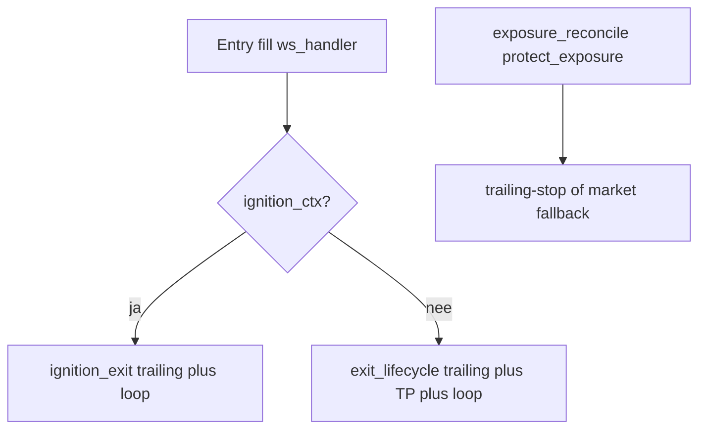
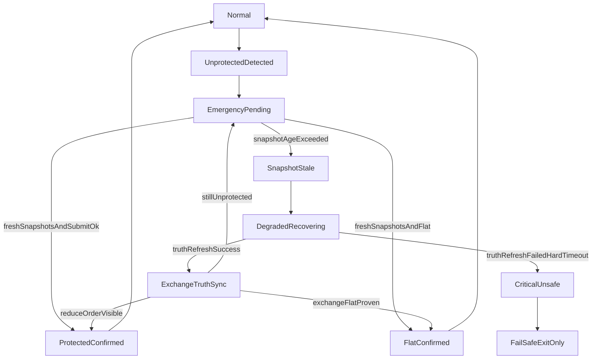

# Exit-paden en bescherming — feitelijk gedrag (read-only)

Feitelijke inventarisatie van runtime exit-paden in Krakenbot: orchestratie, exchange-order types, beschermingsvensters, berekeningen en afwijkingen t.o.v. commentaar/Kraken-docs.

**Update (implementatie):** native trailing wordt strakker gezet via Kraken `amend_order` met `trigger_price_type=pct` (`amend_trailing_stop_trigger_pct`); partial-fill replace plaatst **eerst** nieuwe trailing, **daarna** cancel oude; maker TP gebruikt `post_only=true`; `execution_orders.limit_price_quote` voor `trailing-stop` = **trail bps**. Zie [EXIT_PATH_VALIDATION_RUNBOOK.md](EXIT_PATH_VALIDATION_RUNBOOK.md) voor bewijs-runbook.

**Update (herstelplan-leakage, maart 2026):** Belangrijke wijzigingen in exit-semantiek:
- **Cancel-first exit** (B2): `cancel_protection_and_market_exit` cancelt eerst bescherming, wacht op cancel-or-fill, daarna market exit op balance-qty. Voorkomt double-exit.
- **Staleness guards** (C1/C2): alle `price_cache`-aanroepen gebruiken `snapshot_fresh` / `last_price_fresh` met max_age; stale data leidt tot bail, niet tot stille fallback.
- **RecvResult** (F2): `recv_timeout` retourneert `RecvResult::Message | Timeout | ChannelClosed`; channel close wordt als error geëscaleerd (bail), niet als timeout behandeld.
- **Fill price zero-guard** (A3): fills met prijs 0 worden afgewezen in `ws_handler` vóór ledger-verwerking.
- **Market order deadline** (D2): market orders krijgen automatisch `deadline = now + 5s`.
- **OTO trailing-stop** (D4): optionele conditional trailing-stop attached aan entry order; `discover_oto_trailing_stop` in exit_lifecycle. **Kraken WS v2:** bij `conditional` (OTO) mag **`cl_ord_id` niet** in `add_order` — anders `EOrder:cl_ord_id is not supported on conditional close`. De bot stuurt geen `cl_ord_id` op de wire, behoudt wel de lokale id in DB + `OrderTracker`, en koppelt executions via `order_id` + symbool (`OrderTracker::resolve_cl_ord_id`, zie [Kraken executions / add_order](https://docs.kraken.com/api/docs/websocket-v2/executions/)).
- **Exit qty normalisatie** (F3): `normalize_exit_qty` voorkomt dust-accumulatie bij market exits.
- **time_stop_secs=0 guard** (F1): clamp naar 60s met `EXIT_TIME_STOP_MISCONFIGURED` warning.
- Zie [HERSTELPLAN_LEAKAGE.md](HERSTELPLAN_LEAKAGE.md) voor het volledige plan.

---

## 1. Exit capability overzicht

| Pad | Module / entrypoint | Exchange order(s) | Opmerking |
|-----|---------------------|-------------------|-----------|
| **Native trailing-stop (primair)** | [`src/execution/exit_lifecycle.rs`](../src/execution/exit_lifecycle.rs) `run_post_fill_exit_phase`, [`src/execution/ignition_exit.rs`](../src/execution/ignition_exit.rs) `run_ignition_trailing_exit`, [`src/execution/protection_flow.rs`](../src/execution/protection_flow.rs) `protect_exposure` | `add_order` met `order_type: "trailing-stop"`, `triggers`: `reference=last`, `price_type=pct`, `price = trail_bps/100` | Zie [`src/exchange/auth_ws.rs`](../src/exchange/auth_ws.rs) `add_trailing_stop_order` |
| **Statische stop-loss** | [`src/exchange/auth_ws.rs`](../src/exchange/auth_ws.rs) `add_stop_loss_order` | `order_type: "stop-loss"`, static trigger | Nog aanwezig in API-laag; **post-fill primary path plaatst dit niet meer** (trailing-only in exit/ignition) |
| **Maker take-profit (limit)** | [`src/execution/exit_lifecycle.rs`](../src/execution/exit_lifecycle.rs) | `add_order` `limit` + `limit_price`; **`post_only` wordt als `None` meegegeven** (~regels 412–421) | Commentaar noemt post_only maker; implementatie wijkt af |
| **Interne TP → market** | Zelfde monitor-loop | `cancel_protection_and_market_exit` → **cancel-first**: cancel bescherming, `wait_for_cancel_or_fill`, daarna market op balance-qty (genormaliseerd via `normalize_exit_qty`) | Prijs-check op `price_cache::last_price_fresh` (staleness guard) vs `tp_level` uit fill |
| **Panic PnL → market** | `exit_lifecycle`, `ignition_exit` | Idem cancel-first market exit; bail `MARKET_FILL_TIMEOUT_EXPOSURE_RISK` bij fill-timeout | Drempel uit `ExitConfig.panic_pnl_bps` / `PANIC_PNL_BPS` |
| **Time stop → market** | Beide exit-engines | Cancel TP + cancel-first trailing, dan market | `time_stop_secs`; bij `0` wordt **60s** gebruikt met `EXIT_TIME_STOP_MISCONFIGURED` warning (F1) |
| **Ignition state ImmediateExit** | [`src/execution/ignition_exit.rs`](../src/execution/ignition_exit.rs) | `cancel_sl_and_market_exit` | Bij `Quiet`/`Compression` zonder `trail_activated` |
| **Emergency protection** | [`src/execution/protection_flow.rs`](../src/execution/protection_flow.rs) | Trailing ACK → bevestigd; anders `try_market_fallback` / `market_close_exposure` | `compute_stop_price` wordt nog berekend voor logging/normalisatie; **submit is trailing-first** (~739+) |
| **Position monitor TP / trail** | [`src/execution/position_monitor.rs`](../src/execution/position_monitor.rs) | Bij TP: cancel + market na reconcile; anders `amend_stop_loss_trigger` | Alleen posities met DB `execution_orders` `strategy_context IN ('emergency_stop','exit_sl')` **én `side='sell'`** — **shorts vallen hier buiten** |

**Orchestratie na entry-fill:** [`src/execution/runner.rs`](../src/execution/runner.rs) / [`src/execution/live_runner.rs`](../src/execution/live_runner.rs): bij `ignition_ctx` → `run_ignition_trailing_exit`, anders `run_post_fill_exit_phase` met `exit_config_for_exit_strategy` uit [`src/pipeline/strategy_selector.rs`](../src/pipeline/strategy_selector.rs).

## 1a. Beschermingslaag — deadlock-recovery (doelarchitectuur)

Als **private-WS snapshots** (balances / own orders) te oud worden terwijl `exposure_reconcile` nog **onbeschermde exposure** ziet, kan de combinatie van fail-closed regels en retry-loops leiden tot een **langdurige `entry_halt`** zonder aantoonbaar herstelpad. Onderstaande state machine beschrijft de **beoogde** protection-control flow (truth refresh, gedegradeerde modus, escalatie) — zie het interne plan *Protection Deadlock Reliability*; implementatie is gefaseerd en wijkt tot die tijd mogelijk af van de huidige code.

---

## 2. Scenario-matrix (kern)

Legenda bescherming: **volledig** = trailing (of na ACK) op volledige `protected_qty`; **gedeeltelijk** = qty-mismatch of venster tussen cancel en nieuwe ACK; **onbeschermd** = geen geldige beschermingsorder / expliciet market-pad zonder hedge.

| Scenario | Pad | Bescherming | Duur / oorzaak |
|----------|-----|-------------|----------------|
| Direct na eerste fill | `run_post_fill_exit` of `ignition_exit` start direct; trailing `add_trailing_stop_order` | **Volledig** na WS ACK van trailing | Tot ACK: kort venster (timeout ~15s wait); bij reject → geen volledige bescherming in die fase |
| Partial fill (meer volume) | [`ws_handler.rs`](../src/execution/ws_handler.rs): `EntryFillInfo.quantity_base = cum_qty_after`; [`exit_lifecycle.rs`](../src/execution/exit_lifecycle.rs): bij hogere `cum_qty` cancel+replace trailing (+ TP) | **Gedeeltelijk** tijdens replace | Expliciet: cancel oude trailing, nieuwe submit; mislukt add → log “partial remains under previous protection” |
| Na volledige fill | Zelfde als eerste fill met finale qty | **Volledig** na ACK | — |
| Favorable move | Native trailing volgt **peak t.o.v. last** (exchange); bot trackeert `highest_price`/`lowest_price` voor **interne** TP/panic/TSL-branch | **Trail distance (bps)** kan strakker via `amend_trailing_stop_trigger_pct` (ignition + exit_lifecycle); ATR kan **later** worden geadopteerd als DB eerst leeg was | — |
| Adverse move | Trailing kan triggeren; panic onder drempel → market | **Na trigger**: positie sluit via market fill van trailing | — |
| Snelle kleine winst | Geen aparte regel; TP alleen als `tp_bps` en (maker of interne check) | Afhankelijk van config | Interne TP gebruikt **last** uit cache |
| Reject / amend failure | Trailing add fail → logs; partial replace fail idem; ignition qty amend faalt → warn | **Risk**: oude order weg of qty fout | Runtime-logica |
| Ontbrekende position/protection state | `protect_exposure`: `price_cache_empty` → `Pending`; truth degraded → `prefer_trailing` + 15m-ATR trail (fallback **50 bps**). Staleness guard via `price_cache::snapshot_fresh(max_age)` | **Onbeschermd / Pending** tot cache/ACK | Platform + runtime |
| Position resize (increase) | Zie partial fill replace; ignition: `amend_order` qty op **zelfde** order id | **Soms** als amend slaagt | Kraken/platform |
| Reconnect / startup open pos | `exposure_reconcile` + `protect_exposure` in runner/live_runner | Trailing of market fallback | Geen automatische hervatting van **volledige** exit_lifecycle voor oude trades — alleen protection + optioneel monitor |
| Open positie zonder actieve protection | Detectie via reconcile → `protect_exposure` / retry loop | Tot bescherming: **onbeschermd** | — |
| Time-based signal | Deadline in loop → time stop market | Cancel bescherming dan market | — |
| TP-conditie | Maker fill op exchange OF `last` ≥ tp_level (internal) → market exit na cancel bescherming | Tijdens market exit: bescherming wordt gecanceld na market ACK (`cancel_sl_and_market_exit`) | Invariant bedoeld: bescherming actief tot market ACK |
| Trailing strakker zetten (lifecycle) | `exit_lifecycle`: gunstige move → `trail_tighten_candidate_bps` + `amend_trailing_stop_trigger_pct` (nooit verruimen); plus ATR-mid-trade adoptie | Geen oudere `trailing_stop_placed`-variabele meer in deze module — zie [EXIT_PATHS_VALIDATION_202603.md](EXIT_PATHS_VALIDATION_202603.md) | Exchange amend ACK-afhankelijk |

---

## 3. (T)SL plaatsbaarheid matrix

| Scenario | Statische SL (API) | Native TSL | Blokkeerders |
|----------|-------------------|------------|--------------|
| Direct na fill | **Niet** gebruikt als primair in post-fill engines | **Ja** (primair) | Reconcile `AllowExitSubmit`; WS ACK timeout |
| Tijdens fill (vóór ACK entry) | — | **Nee** op exchange voor die entry | Bot start exit **na** fill processing |
| Pas na full fill | Zelfde als partial: cum_qty gedreven | **Ja** | — |
| Na increase | Cancel+replace trailing (`exit_lifecycle`); ignition: qty amend | **Ja** / **soms** | Amend/replace fail |
| Na reduce | Niet expliciet in geziene exit-loop | **Implicit** via balance bij market exits | — |
| Startup bestaande positie | `protect_exposure`: **trailing**, geen static SL submit in happy path | **Ja** | `price_cache_empty` → pending; trailing reject → market |
| Cancel/reject protection | Retry / market fallback | **Opnieuw** proberen | `Insufficient funds` → doctrine breach / remediation |
| Geen avg_cost, wel live prijs | `compute_stop_price` gebruikt cache + emergency % (`protection_flow.rs` ~1063+) | **Ja** (trail distance uit ATR helper of degrade constant) | Trailing vereist nog steeds geldige qty/side |
| Mismatch position vs protection size | `load_open_exit_qty_per_symbol` in exposure layer | **Gedeeltelijk** beschermd | Runtime + DB vs exchange |
| Exchange errors | Gelogd; market fallback | **Soms** | Platform validation |

**Ignition “tighten trail”:** `current_trail_bps` wordt in Rust aangepast (mode-based + policy); de exchange-distance wordt bij **native trailing** gezet via `amend_trailing_stop_trigger_pct` zodra `trail_activated` en de gewenste trail **strakker** is dan `exchange_trail_bps`. Optioneel `amend_order` voor **qty** bij extra fills blijft.

**Exit_lifecycle native trailing amend:** Strakkere trail-distance en **ATR-mid-trade adoptie** gebruiken dezelfde `amend_trailing_stop_trigger_pct`-flow na reconcile. De oudere `amend_stop_loss_trigger`-loop blijft alleen relevant voor het **niet**-native-trailing pad (`use_trailing_stop == false` met static SL-semantiek — type-inconsistent als `sl_order_id` al een trailing id is).

---

## 4. TP-gebruik analyse

- **Inputs TP-niveau:** `fill_price_f64` (met staleness guard `price_cache::snapshot_fresh` als fallback; bail bij stale/empty) en `tp_bps` uit [`ExitConfig`](../src/trading/exit_state.rs) / [`strategy_selector`](../src/pipeline/strategy_selector.rs) (per `SelectedExitStrategy`).
- **Maker TP:** limit order naast trailing; timeout **30s** (`MAKER_TP_FILL_TIMEOUT_SECS`) → cancel TP + cancel-first market exit op **balance_cache** qty (genormaliseerd via `normalize_exit_qty`).
- **Interne TP:** als geen maker TP order id: vergelijk `price_cache::last_price_fresh` (staleness guard) met `tp_level`.
- **Fees/spread/ATR:** niet expliciet in TP-formule; ATR (15m bars, zie `trail_atr.rs`) voor **trail_bps**, niet voor TP.
- **Parallel:** `position_monitor` harde **200 bps** TP → market voor subset van posities (zie §1 filter).

---

## 5. Docs-conformiteit vs eigen interpretatie

**Conform Kraken WS v2 patronen (hoog niveau):**

- `trailing-stop` met `triggers.reference = last` en `price_type = pct` sluit aan bij gangbare Spot WS v2 shape (zie ook `.cursor/rules/kraken-ws-implementation-checklist.mdc`).
- `amend_order` met `trigger_price` + `trigger_price_type: static` voor stop-loss is wat `auth_ws.rs` implementeert.

**Eigen interpretatie / afwijkingen:**

- **Trail bps v1:** [`src/execution/trail_bps_v1.rs`](../src/execution/trail_bps_v1.rs) — `max(fee_floor, α(horizon)·ATR15m, M_min) × regime`, daarna clamp + optionele strategy floor. Ruwe ATR15m (ongeklemd) uit [`src/execution/trail_atr.rs`](../src/execution/trail_atr.rs). Zie [`docs/TRAIL_BPS_V1.md`](TRAIL_BPS_V1.md). Fees: **2× taker** + 10 bps slip (account-tier). Horizon alleen via α op `time_stop_secs` (exit-config / ignition / emergency 300s).
- **Emergency trail distance:** `should_prefer_trailing_by_expectancy` (PnL ≥ 20 bps) → zelfde 15m-ATR-helper; **niet**-prefer-trailing pad gebruikt nog `DEGRADE_TRAIL_BPS` (0,8%) — `protection_flow.rs`.
- **Maker TP zonder `post_only: true`:** wijkt af van commentaar in `exit_lifecycle.rs` en van “post_only maker” intentie.
- **Variabelen `sl_order_id` / logs `EXIT_SL_*`:** vaak **native trailing** order id — semantiek is misleidend t.o.v. echte stop-loss.
- **Ignition module comment “SL-only”:** gedrag is **native trailing**, niet static SL.

---

## 6. Open risico’s / onduidelijkheden

1. **Type-mismatch:** `amend_stop_loss_trigger` op order id dat een **trailing-stop** is (`exit_lifecycle` wanneer `use_trailing_stop == false`).
2. **Historische doc vs code:** oude beschrijving van `trailing_stop_placed` / breakeven-tak komt **niet meer voor** in huidige `exit_lifecycle.rs`; trail-gedrag loopt via o.a. **tighten + ATR-adoptie**. Zie [EXIT_PATHS_VALIDATION_202603.md](EXIT_PATHS_VALIDATION_202603.md).
3. **Ignition / exit_lifecycle:** als amend/ACK faalt, kan gewenste trail tijdelijk alleen in-memory blijven t.o.v. exchange — retries en logs zijn runtime-afhankelijk.
4. **Position monitor:** alleen `side = 'sell'` protection rows — **short posities** niet in deze monitor-query.
5. **Bescherming vóór eerste fill:** `exit_state.rs` conceptueel `ProtectedPendingFill`; runtime hangt exchange-bescherming **aan op (partial) fill** (`ws_handler` + runner).
6. **Kraken gedrag:** `amend_order` met `trigger_price_type=pct` voor trailing-stop distance wordt gebruikt voor strakker zetten + ATR-adoptie; platform-edge-cases blijven monitoren via ACK/logs.

## 7. Opgeloste risico’s (herstelplan-leakage, maart 2026)

- **Double-exit risico** → opgelost via cancel-first flow (`cancel_protection_and_market_exit`) + `classify_cancel_or_fill` order_id verificatie (B2).
- **Stale price decisions** → opgelost via staleness guards `snapshot_fresh` / `last_price_fresh` op alle price_cache-callsites (C1/C2).
- **Silent channel close als timeout** → opgelost via `RecvResult` enum met expliciete `ChannelClosed` variant (F2).
- **Fill met prijs 0 in ledger** → opgelost via zero-guard in ws_handler vóór fills_ledger (A3).
- **VWAP-corruptie bij positiereductie** → opgelost via expliciete branch-logica in fills_ledger (A1).
- **Fees ontbreken in realized PnL** → opgelost via `compute_realized_pnl` met proportionele fee-aftrek (A2).
- **REST in execution hot path** → volledig geëlimineerd; price_cache (WS-fed) vervangt REST `get_best_bid/ask` (D1).
- **Broadcast lag ongedetecteerd** → opgelost via `was_lagged()` + escalatie naar `PRIVATE_WS_HUB_RELIABILITY_DEGRADED` (B4).
- **Dust bij exit qty** → opgelost via `normalize_exit_qty` (F3).

---

## Primaire bronbestanden

- [`src/execution/exit_lifecycle.rs`](../src/execution/exit_lifecycle.rs)
- [`src/execution/trail_atr.rs`](../src/execution/trail_atr.rs)
- [`src/execution/trail_bps_v1.rs`](../src/execution/trail_bps_v1.rs)
- [`src/execution/ignition_exit.rs`](../src/execution/ignition_exit.rs)
- [`src/execution/protection_flow.rs`](../src/execution/protection_flow.rs)
- [`src/exchange/auth_ws.rs`](../src/exchange/auth_ws.rs)
- [`src/execution/runner.rs`](../src/execution/runner.rs)
- [`src/execution/live_runner.rs`](../src/execution/live_runner.rs)
- [`src/execution/exposure_reconcile.rs`](../src/execution/exposure_reconcile.rs)
- [`src/execution/position_monitor.rs`](../src/execution/position_monitor.rs)
- [`src/pipeline/strategy_selector.rs`](../src/pipeline/strategy_selector.rs)
