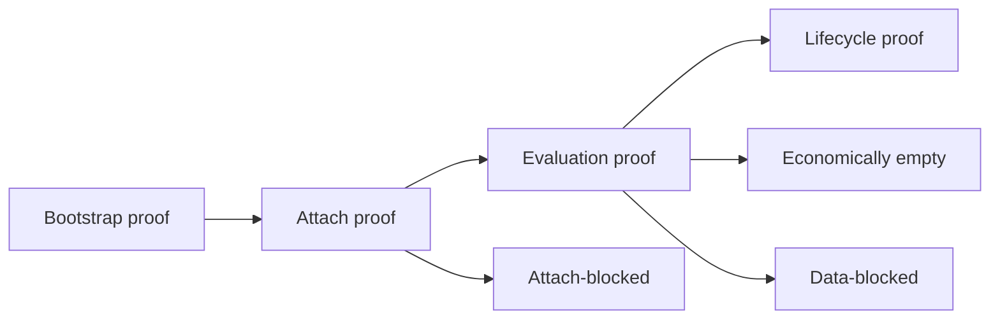

# Validation Model — Current

DOC_STATUS: CURRENT  
DOC_ROLE: validation_model  

**Rol van dit document:** Welke soorten validatie bestaan, hoe bootstrap/attach/evaluation/lifecycle proof werken, en hoe je economically empty vs data-blocked vs attach-blocked onderscheidt. SSOT: [ENGINE_SSOT.md](ENGINE_SSOT.md).

---

## 1. Soorten validatie

| Type | Doel | Bewijs |
|------|------|--------|
| **Bootstrap proof** | Proces start, config geladen, DB bereikbaar, git traceability | Logs: EXECUTION_ENGINE_START, git_commit, git_branch; DB pool ready. |
| **Attach proof** | Execution kan binden aan bestaande epoch/snapshot (split mode) | current_valid_epoch_id of current_epoch_for_exit_only retourneert; DATA_INTEGRITY_VERIFIED. |
| **Evaluation proof** | Readiness + pipeline draaien; outcome Execute of Skip traceerbaar | LIVE_EVALUATION_STARTED, LIVE_EVALUATION_AUDIT, LIVE_EVALUATION_COMPLETED; BLOCKER_DISTRIBUTION bij Skip. |
| **Lifecycle proof** | Order van submit tot fill/reject/cancel met DB en logs | DB_FIRST_ORDER_PERSISTED, ORDER_ACK, ORDER_FILL; execution_orders, fills, positions, realized_pnl. |

---

## 2. Bootstrap proof

- **Wat:** Engine start, migrations toegepast, pool klaar, geen crash.
- **Markers:** EXECUTION_ENGINE_START, environment/validation_phase, git_commit, git_branch, build_profile.
- **Script:** Start run; controleer logs op deze markers.

---

## 3. Attach proof

- **Wat:** Execution-only mode bindt aan een epoch (valid of degraded) en snapshot.
- **Voorwaarde:** Ingest heeft minstens één epoch met status valid of degraded gepubliceerd.
- **Markers:** DATA_INTEGRITY_VERIFIED, EXECUTION_UNIVERSE_BOUND (of equivalent), bound_epoch_id, bound_run_id.
- **Falen:** Geen valid/degraded epoch binnen max_epoch_age → skip of exit-only; log reden (no_valid_epoch).

---

## 4. Evaluation proof

- **Wat:** Per cycle: readiness + pipeline; execute_count/skip_count; bij Skip: blocker distribution.
- **Markers:** LIVE_EVALUATION_STARTED, LIVE_EVALUATION_AUDIT (system_live_ready, block_type), DATA_INTEGRITY_MATRIX, LIVE_EVALUATION_COMPLETED, eventueel NO_ORDER_ECONOMIC_GATING, BLOCKER_DISTRIBUTION, NO_ORDER_SYMBOL_DROP.
- **Bewijs:** Logs tonen dat evaluatie heeft gedraaid en waarom wel/geen order.

---

## 5. Lifecycle proof

- **Wat:** Eén order: persist → submit → ack → fill (of reject/cancel); DB-rijen en events.
- **Markers:** DB_FIRST_ORDER_PERSISTED, ORDER_ACK, ORDER_FILL (of REJECT/CANCEL); fills_ledger, state_machine.
- **DB:** execution_orders, execution_order_events, fills, positions, realized_pnl (bij close).
- **Scripts:** validate_execution_on_server.sh, validate_live_engine_server.sh.

---

## 6. Economically empty vs data-blocked vs attach-blocked

| Situatie | Betekenis | Typische oorzaak |
|----------|-----------|-------------------|
| **Economically empty** | Matrix groen, valid epoch, maar geen order (alleen Skip) | Pipeline: SurplusBelowFloor, RegimeChaos, EdgeNegative, StrategyMismatch, etc. |
| **Data-blocked** | Geen order door data/runtime | Geen valid epoch; data_stale; matrix false (universe_viability, l3_integrity, …). |
| **Attach-blocked** | Execution-only kan niet binden | Geen recente epoch (ingest niet gedraaid of geen valid/degraded). |

**Rapportage:** Na run expliciet vermelden: no-order toe te schrijven aan [economic gating | data-blocked | attach-blocked | mix]. Zie INGEST_EXECUTION_EPOCH_CONTRACT.md sectie 7.

---

## 7. Diagram

